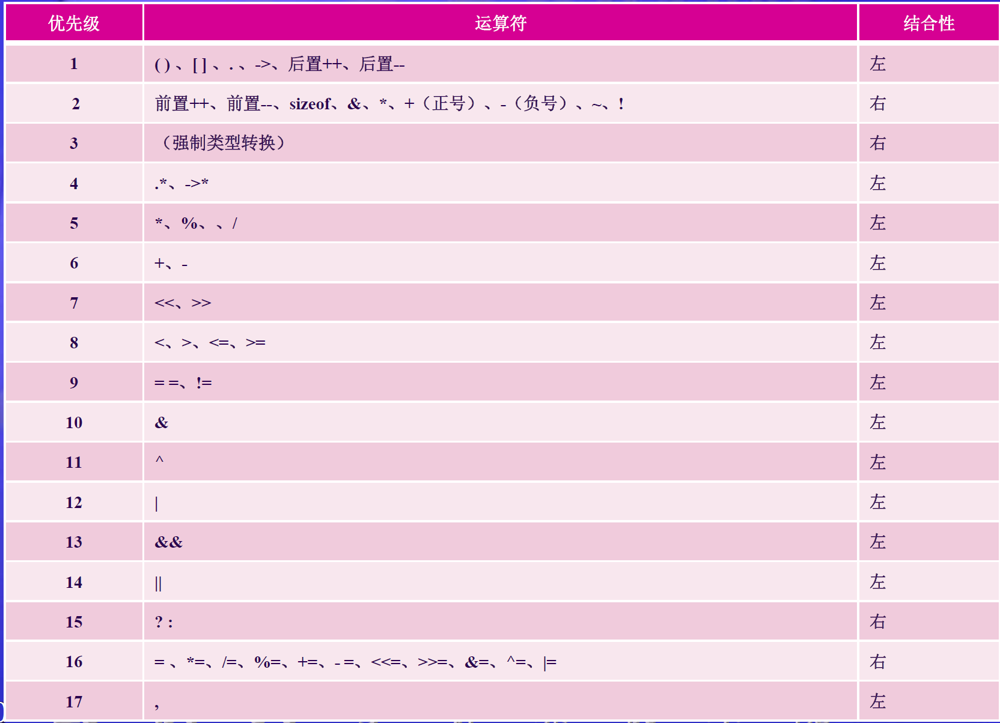
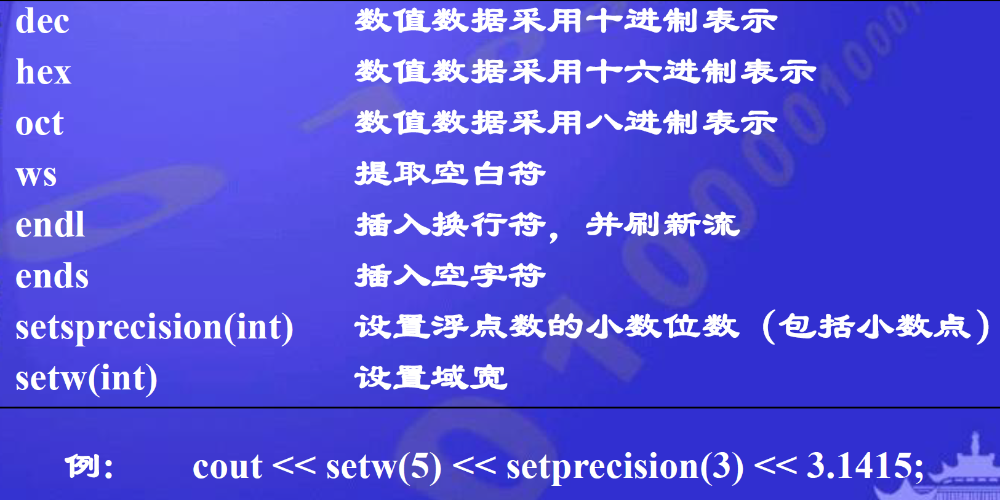
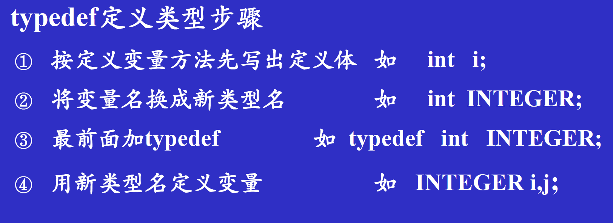

## 第二章

- `volatile` 易变的     当要求使用volatile声明变量值的时候，系统总是重新从它所在的内存读取数据，即使它前面的指令刚刚从该处读取过数据，编译器将不会优化该变量的代码

- `register` 寄存器变量  就是编译程序时希望把该变量放到寄存器中，这样可以提高对该变量的访问速度。由前言可知，CPU访问寄存器的速度是高于访问内存的速度；__不需要经常修改但常常访问，cpu能够接受的类型，小于等于整型长度，局部静态变量无法定义为寄存器变量，不能定义任意多个计算器变量。cpu寄存器数量有限！！！__

- `static` 静态关键字    存在全局存储区中，仅在变量的作用范围内可见。生命周期变长。__修饰全局变量时，改变了全局变量的作用域，限制了在当前文件中，无法被其他文件extern--->（内部链接）

- `extern` 外来的关键字  声明外部变量， 具有外部链接的对象，被说明的对象必须是**静态生存期的变量**（全局变量或静态变量）。

- **全局变量默认extern类别，局部变量默认局部动态生存期。

- `thread_local` 具有线程存储生存期，是 Thread 的局部变量，用于编多线程程序。只能用于**修饰命名空间以及块作用域中的变量，或者已经被指定为 static 的变量。

- `mutable` ：只能用于**类数据成员**，并且**不能与 const 或者 static 同时使用，不能用来修饰引用变量**。 mutable关键字是为了突破 const 关键字的限制 被 mutable 关键字修饰的成员变量永远处于可变的状态，**即使是在被const 修饰的成员函数中。

- `constexpr`修饰变量和`const`修饰变量的区别在于：初始化const变量的**可以不是**一个constexpr，初始化constexpr的**必须是constexpr

- **基本运算符优先级
    高
    单目运算符
    算术运算符（先乘除，后加减）
    移位运算符
    关系运算符
    逻辑运算符（！除外）
    条件运算符
    赋值运算符
    逗号运算符
    低**
    
    
    - ++x返回的是增加后的数据，而x++返回的是增加前的数据，--同理
      
    - 逻辑运算符的短路原则
      
###  不同数据类型的转换

#### 短->长

无符号数，高位补0；有符号数，高位补符号位

#### 长->短

截取低位赋值，丢弃高位

### 数据类型显示转换
- `int(z)`
- `(int)z`
- 类型转换操作符<类型说明符>(表达式)
- 类型操作转换符有:`const_cast,dynamic_cast,reinterpret_cast,static_cast``如static_cast<int>(z)`
  
### 简单IO格式控制




### 简单控制语句

##### switch

break；跳出case分支的跳转语句，不用break；会依次执行其他case，最终跳出switch语句

#### typedef声明



- `typedef int INTEGER`
- `typedef int Array[10];`数组要放在后面，因为[]是在类型名的类型名的后面
- `typedef int* IntPtr;`原始定义:int* a;->int* IntPtr;->typedef int* IntPtr;
- `typedef int (*FuncPtr)(int,int);`原型:`int (*funcPtr)(int,int)`,前面为返回值，后面括号内为参数的类型
- ```c++
    { int month;
    int day;
    int year;
    }d;
  typedef struct date{
    int month;
    int day;
    int year;
  }DATE;```
  ```

#### typedef-----C++11新用法

`using 别名  = 类型名;`

```c++
//例如:
using SI = Sales_item; //SI是别名
```

注意：

```c++
//当typedef用类型别名指代复合类型或常量时，把类型别名用到声明语句中会产生意想不到的结果。
typedef char* pstring;//pstring是一个指向char类型的指针
const pstring cstr = 0;//注意，const char* cstr = 0;是错误的，并不是指向一个const char的指针
//正确：cstr是一个指向char类型变量的常量指针
const pstring *ps;//ps是一个指向常量const类型指针的指针
```

#### auto和decltype

- auto类型由编译器分析表达式的类型
- 当我们定义一个变量与某一表达式类型相同，但是不想用该表达式初始化该变量时使用。
- 例：decltype (i)j = 2;//根据i的数据类型确定j的数据类型

## 第三章

- 被调函数定义的位置放在主调函数之后，则必须在函数调用之前使用被调函数的原型说明；一定要声明之后编译器才知道后面出现了这个函数
- void addrat(int,int); void addrat(int a,int b);两种函数原型均可
- rand()返回一个伪随机数;void srand(unsigned int seed)为 rand 函数设置一个起始点，从而影响 rand 函数生成的随机数序列。
  
### 函数的参数传递
- 函数调用时才分配形参储存单元
- 实参类型必须与形参相符
- 值传递是单向传递，无法修改实值；引用传递是双向传递
- 常引用作参数可以保障实参数据的安全
- 传递指针可以间接实现双向传递（值传递的特例）
- **指针形参的具体实现方式：在函数中创建一个新的指针变量，并将形参指针的值（即内存地址）赋值给新的指针变量，这两个变量实际指向同一块内存空间。在函数内部的操作全是对这个新的指针变量，如果改变所指对象的值，则对象的值改变；若改变指针值（即改变内存地址），则不影响实参指针**
- 引用相当于对标识符取别名，声明一个引用时，**必须同时对它进行初始化，指向一个已经存在的对象**，相当于一个常量指针（**Constant Pointer**），不可以改变指向，但可以改变指向对象的值，同时引用并没有内存空间，因为并没有创建变量
  - 实现双向传递通常使用引用传递，形参与实参共用一个内存空间
    
### 内联函数
- 声明时使用关键字inline
- 编译系统将程序中出现内联函数调用的地方用函数体进行替换。
- 内联函数中**不可以出现循环结构和switch语句**
- 不加inline关键字的短小、频繁调用的函数也可能被编译器自动认为是内联函数；同样，加了inline关键字的函数也不一定就是内联函数（太过复杂就不是）
- **是否内联由编译器去决定**

### constexpr函数

- 能用于常量表达式的函数
- `constexpr` 函数的函数体必须非常简单，通常只能包含一条 `return` 语句（C++14 放宽了限制）。
- **`constexpr` 函数**用于在编译时计算函数结果，适用于常量表达式和性能优化。

### 带默认形参的函数

- **有默认参数的形参必须放在形参列表最后**，否则会造成歧义


### 函数重载

- 形参类型不同或者形参个数不同
- 注意如果没有完全匹配的重载函数，编译器会进行实参的数据类型隐式转换，以找到最佳匹配的函数，**但此时可能会出现二义性**
- 函数重载和默认参数同时使用，有可能引起二义性```
    void DrawCircle(int r=0,int x=0, int y=0);
    void DrawCircle(int r);
- 函数返回类型不同不能作为重载条件

## 第四章

- 只有在类实例化时，才能给类中的数据成员初始化
- 访问权限可以任意顺序出现，但每个成员只能有一种访问属性
- `public`任何外部函数都可以访问
- `private`只允许本类中的函数及友元访问
- `protected`只能被本类成员函数，派生类成员函数和友元访问。(**与`private`差别在于继承过程中派生类能够访问)**

### 类的成员函数

- 可以在类内声明，类外添加类名作用域实现；也可直接在类内给出函数体，形成内联成员函数
- 允许声明重载函数和带默认形参值的函数
- **在类中定义的函数成员自动成为内联函数**，在类外定义需要添加inline关键字（**声明不写，定义时写inline**）
- 不能在函数原型处说明inline，否则编译器会处理为普通函数

### 构造函数

- 如果没有声明构造函数，编译器会自动生成默认构造函数，参数列表为空
- 构造函数可以是内联函数、重载函数、带默认参数值的函数
- 构造函数函数名与类名相同，且不指定返回值类型
- 构造函数可以进行重载操作
- 如果显式定义了构造函数，则编译器不再提供默认构造函数
- **无形参的构造函数称为默认构造函数，全部参数都有默认形参值的构造函数也是默认构造函数
- **成员初始化顺序与它们在类定义中的出现顺序一致，而不是在初始值中出现的顺序!早声明的先执行初始化
- const成员或引用成员必须将其初始化！
- 委托构造函数：使用它所属类的其他构造函数执行自己的初始化过程
- 拷贝构造函数：用一个已经存在的本类对象初始化新对象
  
  ```c++
  类名 (const 类名& 对象名);//声明原型
  类名::类 (const 类名& 对象名){
  }//实现
  ```
- 拷贝构造函数被调用的三种情况：
  - 定义新对象时以另一个对象为初始值
  - 函数的形参是类的对象，将使用实参对象初始化形参对象
  - 如果函数的返回值是类的对象，函数执行完成返回主调函数时，将使用return语句中的对象初始化一个临时无名对象，传递给主调函数，此时发生复制构造。

### 析构函数

- 析构函数是类的一个公有成员函数，可以写在类内，也可以写在类外
- 析构函数不能有参数，**不能重载**

### 移动构造函数(不太可能考)

- 对持久存在变量的引用称为左值引用，用&表示（即第3章引用类型）,对短暂存在可被移动的右值的引用称之为右值引用，用&&表示
- 通过标准库`<utility>`中的`move`函数可将左值对象移动为右值
  
  ```c++
  float n = 6;
  float &lr_n = n; //左值引用
  float &&rr_n = n; //错误，右值引用不能绑定到左值
  float &&rr_n = n * n; //右值表达式绑定到右值引用
  ```

通过标准库<utility>中的move函数可将左值对象移动为右值
float n = 10;
float &&rr_n = std::move(n); //将n转化为右值

```c++

#include<utility>
class astring {
public :
std::string s;
astring (astring&& o) noexcept: s(std::move(o.s)) //显式移动所有成员
{ 函数体 }

}//不分配新内存，被移动的对象不应再使用，避免多余复制操作，除非销毁或者重新赋值
```

### default 、delete 函数

- =default:要求编译器生成默认或拷贝构造函数
- =delete:要求编译器删除指定函数，除了析构函数之外都可以删除
  
  ```c++
  Mystr() = default;//默认无参构造函数
  Mystr(Mystr &str) = default;//默认拷贝构造函数
  Mystr(Mystr &str) = delete;//删除拷贝构造函数 
  ```

### 前向引用

- **前向引用并没有定义类，无法在提供完整定义类之前声明该对象，也不能再内联成员函数中使用该类，因为编译器不知道这个类的结构是怎样的，只知道存在这个类，不能涉及类的细节**
- 仅仅进行前向声明而没有定义的类是不完整的，这样的类，只能用于**定义指针、引用、以及用于函数形参的指针和引用。

### 结构体

- 结构体与类几乎完全相同，仅默认访问权限不同。class默认访问权限是private,而struct默认访问权限是public

### 联合体union

- 成员共用相同的内存单元
- 任何两个成员不会同时有效，只会取其一

### 枚举union

- 不限定作用域的枚举类型和限定作用域的枚举类型
- 不能对枚举元素赋值，但可以声明时初始化
- 枚举元素有默认值，依次为0,1,2,3,.....
- 枚举元素的作用域是全局的，会造成命名空间的污染
- 枚举变量的值可以在运行时修改，但只能赋值为枚举类型中定义的枚举元素。枚举变量只能存储枚举类型中的枚举元素，不能直接赋值为整数（除非进行强制类型转换）。
- 枚举类（限定作用域枚举）枚举类的枚举元素位于枚举类的作用域内，不会污染全局命名空间。- 枚举类的枚举元素不能隐式转换为整数，必须显式转换。可以显式指定枚举类的底层类型（如 `int`、`char` 等）。
  
  ```c++
  //enum 枚举类型名{枚举元素值(变量值) 列表};
  enum Weekday{
    sun,mon,tue,wed,thu,fri,sat
  };
  //限定作用域枚举类
  enum class Weekday {
    SUN, MON, TUE
  };
  Weekday today = Weekday::SUN;  // 必须使用作用域运算符 ::
  int day = static_cast<int>(Weekday::SUN);  // 显式转换为整数
  enum class Weekday : char {
    SUN, MON, TUE
  };
  enum class Color { RED, GREEN };
  enum class TrafficLight { RED, YELLOW, GREEN };
  Color c = Color::RED;  // 不会与 TrafficLight::RED 冲突
  ```

## 第五章
### 标识符的作用域和可见性
- 函数原型的作用域在函数内
- 局部作用域
- 类作用域，包含类内和非内联成员函数的函数体。如果在类作用域以外访问类的成员，要通过**类名（访问静态成员），或者该类的对象名、对象引用、对象指针（访问非静态成员）**。
- 文件作用域：如全局变量
- 命名空间作用域：程序可以有多个命名空间，可以在不同命名空间中使用相同的命名而不混淆

### 生存期
 - 全局变量，静态局部变量（局部可见性）拥有静态生存期
 - 块作用域声明的，没有用static修饰的对象是动态生存期对象（局部生存期对象），不指定初值时，初值不确定
### 类的静态成员
- 分为静态数据成员和静态成员函数
- 不使用静态成员时：所有的类都各自有数据成员，共用一份成员函数(使用this指针来分辨哪个对象调用的)
- 静态数据成员
    - static关键字声明
    - 所有该类的对象共享
    - 必须在类外定义和初始化,用::指明作用域
    - 可以是三种权限之一
- 静态成员函数
    - 类外使用类名和作用域操作符来调用
    - **只能引用该类的静态数据成员或者静态成员函数

### 类的友元
- 友元函数和友元类
- 友元函数能够通过对象名访问private和protect成员
- 有两种形式的友元函数
    - 一个不属于任何类的函数声明为当前类的友元，称为当前类的友元函数
    - 一个其他类的成员函数声明为当前类的友元，称为当前类的友元成员
- 友元函数声明可以放在public、private、protected的任意段中
- 友元类：若一个类为另一个类的友元，则此类的所有成员函数都能访问对方类的**私有成员**
- **友元关系不具有传递性，且是单向的**

### 共享数据的保护
- 对于需要共享但不需要改变的数据应声明为const类型，不改变对象状态的成员函数声明为常函数
- const对象必须初始化
- 常成员函数`类型说明符 函数名（参数表）const;`
- **通过常对象只能调用它的常成员函数
- 对于常数据成员，只能通过构造函数初始化列表方式初始化数据
- **常成员函数可以访问常对象中的数据成员，但仍然不允许修改常对象中数据成员的值（可访问变量但是只读）
- **特例mutable:被mutable修饰的变量，将永远处于可变的状态，即使在一个const函数中`mutalbe double len;//len可以永远被修改`

## 第六章
### 数组
- 数组名是一个地址常量，储存了数组首元素的内存的地址
- 数组地址是连续的
- 数组名作形参，对形参数组的改变会直接影响到实参数组。退化为了指针变量。
- 静态数组（前面加static关键字）只初始化一次，对于大型数组可提高运行效率

### 指针
- 直接访问：按变量名直接存取变量值；间接访问：通过存放变量地址的变量去访问变量
- 空类型指针`void*`，表示不确定指向哪一种数据类型，使用时需要强制类型转换`p1 = (char *)p2;`
- 任何⼀个指针本身的数据值都是unsigned long int型。
- **指针常量(constant Pointer)，指针本身的值不变
- **常量指针（Pointer to constant)，指向常量数据类型
- 指针具有算术运算和关系运算

### 输入整行字符串
 - `getline(cin,s)`输入到s中
 - `getline(cin,s2,','`第三个参数可以设置分隔符作为字符串结束的标志

### 指针数组
- 由指针类型元素组成的数组
- 指针作形参本质仍然是值传递


### 指针型函数
- 函数的返回值是地址
- **不要将非静态局部地址用作函数的返回值，返回的指针要确保在主调函数中是有效、合法的地址。例如不要将局部定义的变量传回主调函数，此时局部变量已经不存在了
- `int* function(){}`

### 指向函数的指针
- `返回值类型 (*functionPointer)(参数类型);`
```c++
void (*functionPointer)(float);//指向函数的指针
functionPointer = printStuff;//printStuff是已有函数
functionPointer(PI);//函数指针调用
```

### 对象指针

- `类名 *对象指针名` 
- `Point *ptr;`

### this指针

- 隐含于每一个类的成员函数中的特殊指针
- 指出成员函数当前操作的数据所属的对象

### 指向类的非静态成员的指针

- `类型说明符 类名::*类成员指针名;`声明指向类内数据成员的指针
- `类成员指针名 = &类名::数据成员名;`
- 访问:`对象名.*类成员指针名`    `对象指针名->*类成员指针名`
- 指向函数：`类型说明符 (类名::*类成员指针名)(参数表);`
- 赋值`指针名=&类名::函数成员名;`
- 访问函数成员  `(对象名.*类成员指针名)(参数表)`   `(对象指针名->*类成员指针名)(参数表)`

### 指向类的静态成员函数

- 不用依赖于具体的对象调用，直接用**普通指针**实现

### new delete

- new 数据类型（初始化参数列表）
- delete 指针名
- new 类型名T [ 数组长度 ]
- **delete[] 数组名p
- `new 类型名T[第1维长度][第2维长度]....`

### vector

- 表示对数组元素的引用，vector数组对象名不表示数组的首地址

### 浅拷贝、深拷贝

- 浅拷贝：仅复制指针的地址，导致指向同一块内存空间
- 深拷贝：重新新建一块内存空间

## 第七章

- **派生类不能继承基类的构造函数和析构函数
- 如果派生类声明了一个和某基类成员同名的新成员（如果是成员函数，则参数表也要相同，参数不同的情况属于重载），**派生的新成员就覆盖了外层同名成员

### 访问控制

- 不同继承方式的影响：1.派生类成员对基类成员的访问权限 2.通过派生类对象对基类成员的访问控制
- **public继承**:
  - 基类的public和protected成员的访问属性在派生类中保持不变，但基类的private成员不可直接访问。
  - 派生类中的成员函数可以直接访问基类中的public和protected成员，但不能直接访问基类的private成员。
  - 通过派生类的对象只能访问基类的public成员
- **protected继承**：
  - 基类的public和protected成员都以protected身份出现在派生类中，但基类的private成员不可直接访问
  - 派生类中的成员函数可以直接访问基类中的public和protected成员，但不能直接访问基类的private成员。
  - 通过派生类的对象不能直接访问基类中的任何成员
- **private继承**：
  - 基类的public和protected成员都以private身份出现在派生类中，但基类的private成员不可直接访问。
  - 派生类中的成员函数可以直接访问基类中的public和protected成员，但不能直接访问基类的private成员。
  - 通过派生类的对象不能直接访问基类中的任何成员。

### 类型兼容原则

- 一个公有派生类对象在使用上可以被作为基类的对象
  - 可以隐含转换为基类对象
  - 派生类对象可以初始化基类的引用
  - 派生类的指针可以隐含转换基类的指针
- 通过基类对象名、指针只能使用从基类继承的成员

### 派生类的构造和析构函数

- 只需要对本类中新增成员进行初始化，继承而来的基类对象可以自动调用基类构造函数完成
- 派生类的构造函数需要给基类的构造函数传参
  
  ```c++
  //单继承
  派生类名::派生类名(基类所需的形参，本类成员所需的形参):基类名(参数表), 本类成员初始化列表
  
  {
  
  //其他初始化；
  
  }；
  //多继承
  派生类名::派生类名(参数表):基类名1(基类1初始化参数
  
  表), 基类名2(基类2初始化参数表), ...基类名n(基类n初始化
  
  参数表), 本类成员初始化列表
  
  {
  
  //其他初始化；
  
  }；
  
  C::C(int i,int j): B(i), c(j){
  
  cout << "C's constructor called." << endl;
  
  }//C是派生类，B是基类，传递i给B的构造函数,c是新增变量
  ```

### 构造、析构函数的调用顺序
- 先调用基类的构造函数，按照**继承时声明的顺序
- 本类成员初始化，按照在**类中的声明顺序
- 析构函数与构造函数调用顺序相反

### 作用域分辨符
- 基类和派生类有相同成员时，通过派生类对象调用的是派生类中的同名成员
- 如果要通过派生类对象访问基类同名成员，需要加上作用域
- 二义性问题可以通过限定类名解决，也可以虚基类、虚函数解决

### 虚基类
- 解决多继承（菱形继承）时可能发生的对同一基类继承多次而产生的二义性问题.
- 虚基类的成员是由最派生类的构造函数通过调用虚基类的构造函数进行初始化的。
- 在整个继承结构中，直接或间接继承虚基类的所有派生类，都必须在构造函数的成员初始化表中给出对虚基类的构造函数的调用。如果未列出，则表示调用该虚基类的默认构造函数。
- 在建立对象时，只有最派生类的构造函数调用虚基类的构造函数，该派生类的其他基类对虚基类构造函数的调用被忽略。

```c++

#include <iostream>
using namespace std;
// 虚基类
class A {
public:
    int data;
    A(int value) : data(value) {
        cout << "A constructed with value: " << value << endl;
    }
};
// 中间类 B，虚继承 A
class B : virtual public A {
public:
    B(int value) : A(value) {
        cout << "B constructed" << endl;
    }
};

// 中间类 C，虚继承 A
class C : virtual public A {
public:
    C(int value) : A(value) {
        cout << "C constructed" << endl;
    }
};

// 最远派生类 D，继承 B 和 C
class D : public B, public C {
public:
    // D 的构造函数需要显式初始化虚基类 A
    //最远派生类负责调用A的构造函数，保证只有一个A
    //先调用虚基类构造，再是直接基类，最后自身
    D(int value) : A(value), B(value), C(value) {
        cout << "D constructed" << endl;
    }
};

int main() {
    D d(10); // 创建 D 的对象
    cout << "Data in D: " << d.data << endl; // 输出 10
    return 0;
}
```

## 第八章 多态


- 编译时动态和运行时多态的本质就是静态类型检查和动态类型检查。
- **基态指针指向派生类对象是一种动态多态
- **基类指针可以指向派生类对象，但仍然调用的是基类成员函数**：但是由于编译时多态的原因，编译器不知道指针指向的对象已经重写了该成员函数
- 可以使用**虚函数

### 运算符重载

- 运算符重载是对已有运算符赋予多重含义，并**没有新增运算符
- **有部分运算符不能重载**，不能重载的运算符举例：`“.”、“.*”、“::”、“?:”、sizeof
- 以下运算符**只允许用成员函数重载：`= ( ) [ ] new delete`
- 重载之后运算符的优先级和结合性都不会改变
- 两种重载方式：**重载为类的非静态成员函数和重载为非成员函数。**
- 重载为非成员函数可以使用**友元访问类的保护和私有成员，与成员函数的区别在于：成员函数有this指针，而友元函数没有this指针**
- 一元运算符重载时：**使用成员函数不必传入对象(有this指针)，而友元函数需要显示传入对象**
- 二元运算符重载时：**成员函数仅需要传入一个参数，而友元函数需要传入两个函数**
- 重载的运算符函数 operator = **不能被继承，且必须是成员函数**
- **拷贝函数用于创建一个新对象**，赋值运算符是改变一个已存在的对象的值

### 虚函数

- **虚函数必须是非静态的成员函数,内联成员函数不能定义为虚函数**
- 构造函数**不能**是虚函数，析构函数**可以是**虚函数
- **只有通过基类指针或引用，才能通过虚函数调用派生类对应函数**
- 在派生类中可以对基类中的成员函数进行覆盖（重定义）
- **每个多态类有一个虚表（virtual table),虚表中有当前类的各个虚函数的入口地址,每个对象有一个指向当前类的虚表的指针（虚指针vptr）**
- **构造函数中为对象的虚指针赋值**,通过多态类型的指针或引用调用成员函数时，通过虚指针找到虚表，进而找到所调用的虚函数的入口地址,通过该入口地址调用虚函数
- 派生类可以不显式地用virtual声明虚函数,编译器会根据函数名称、参数个数、对应参数类型、const限定符是否相同
- 派生类中的虚函数还会隐藏基类中同名函数的所有其它重载形式。**先查找派生类的作用域**，如果找到同名函数，就不再查找基类的作用域。适用于**成员函数、静态函数和虚函数。
- `override`关键字标记派生类中的虚函数，如果没有覆盖已经存在的虚函数，就会报错
- `final`用于标记某个函数，则该函数不能再被它的派生类覆盖，否则编译器报错。

### 纯虚函数和抽象类

- 纯虚函数`virtual 函数类型 函数名(参数表) = 0;`
- 具有纯虚函数的类成为抽象类，**只能作为基类使用，不能实例化对象

## 第九章 模板

### 1. **函数模板**

函数模板允许定义一个通用的函数，可以用于多种数据类型。

#### 语法

```c++
template <typename T>
返回类型 函数名(参数列表) {
    // 函数体
}
```

- `template <typename T>`：声明一个模板，`T` 是模板参数，表示任意类型。
- `typename` 可以用 `class` 替换，两者在模板中含义相同。
- **函数模板可以使用自动类型推导，优先调用普通函数，普通函数无法实现再调用函数模板**，函数模板也可以发生重载，但模板T不能有默认参数
  
  #### 示例：通用的 `max` 函数

```cpp
#include <iostream>
// 定义函数模板
template <typename T>
T max(T a, T b) {
    return (a > b) ? a : b;
}

int main() {
    std::cout << max(3, 5) << std::endl;         // 输出 5
    std::cout << max(3.14, 2.71) << std::endl;   // 输出 3.14
    std::cout << max('a', 'z') << std::endl;     // 输出 z
    return 0;
}
```

---

### 2. **类模板**

类模板允许定义一个通用的类，可以用于多种数据类型。

#### 语法

```cpp
template <typename T>
class 类名 {
    // 类成员
};
```

- `template <typename T>`：声明一个模板，`T` 是模板参数，表示任意类型。
- 类模板的成员函数可以在类内定义（隐式内联），也可以在类外定义。
- **类模板不能使用自动类型推导，必须显示指定类型**
- **类模板中成员函数在调用时才创建**

#### 示例：通用的 `Box` 类

```cpp
#include <iostream>
// 定义类模板
template <typename T>
class Box {
private:
    T value;
public:
    Box(T v) : value(v) {}
    T getValue() const {
        return value;
    }
};

int main() {
    Box<int> intBox(42);
    Box<std::string> strBox("Hello, Templates!");

    std::cout << intBox.getValue() << std::endl;  // 输出 42
    std::cout << strBox.getValue() << std::endl;  // 输出 Hello, Templates!
    return 0;
}
```

---

### 3. **模板参数**

模板参数可以是类型参数（如 `typename T`），也可以是非类型参数（如整数、指针等）。

#### 示例：非类型模板参数

```cpp
#include <iostream>

// 非类型模板参数（整数）
template <typename T, int size>
class Array {
private:
    T data[size];
public:
    void set(int index, T value) {
        data[index] = value;
    }
    T get(int index) const {
        return data[index];
    }
};

int main() {
    Array<int, 5> intArray;
    intArray.set(0, 10);
    std::cout << intArray.get(0) << std::endl;  // 输出 10
    return 0;
}
```

---

### 4. **模板特化**

模板特化允许为特定类型提供特殊的实现。

#### 示例：函数模板特化（重载）

```cpp
#include <iostream>
// 通用模板
template <typename T>
void print(T value) {
    std::cout << "Generic: " << value << std::endl;
}

// 特化版本（针对 const char*）
template <>
void print<const char*>(const char* value) {
    std::cout << "Specialized: " << value << std::endl;
}

int main() {
    print(42);              // 输出 Generic: 42
    print("Hello, World!"); // 输出 Specialized: Hello, World!
    return 0;
}
```

---

### 5. **类模板的默认参数**

可以为类模板参数指定默认值。

#### 示例：类模板的默认参数

```cpp
#include <iostream>
template <typename T = int, int size = 10>
class Array {
private:
    T data[size];
public:
    void set(int index, T value) {
        data[index] = value;
    }
    T get(int index) const {
        return data[index];
    }
};

int main() {
    Array<> intArray; // 使用默认参数 T=int, size=10
    intArray.set(0, 42);
    std::cout << intArray.get(0) << std::endl;  // 输出 42
    return 0;
}
```

## 第十章 泛型程序设计与STL

- STL基本组件：容器（container）、迭代器（iterator）、函数对象（function object）、算法（algorithms）

- **Iterators（迭代器）是算法和容器的桥梁。算法不直接操作容器中的数据，而是通过迭代器间接操作。** 将迭代器作为算法的参数、通过迭代器来访问容器而不是把容器直接作为算法的参数

- 函数对象（function object）：一个行为类似函数的对象，对它可以像调用函数一样调用
  
  - 普通函数就是函数对象
  
  - 重载了“()”运算符的类的实例是函数对象
    
    ```c++
    #include <iostream>
    #include <numeric>
    using namespace std;
    
    class MultClass { //定义MultClass类
    public:
    int operator() (int x, int y) const { return x * y; }
    //重载操作符operator()
    };
    
    int main() {
    int a[] = { 1, 2, 3, 4, 5 };
    const int N = sizeof(a) / sizeof(int);
    cout << "The result by multipling all elements in a is "
    << accumulate(a, a + N, 1, MultClass()) << endl;
    //将类multclass传递给通用算法
    return 0;
    }
    ```
    


## 第十一章 流类库

### 1. **I/O流的概念及流类库结构**

- **流的概念**：流是数据在生产者（如文件、键盘）和消费者（如程序、屏幕）之间流动的抽象。程序通过流对象与文件或设备进行交互。

- **流类库结构**：
  - **抽象流基类**：`ios`是所有流类的基类。
  - **输入流类**：`istream`（通用输入流）、`ifstream`（文件输入流）、`istringstream`（字符串输入流）。
  - **输出流类**：`ostream`（通用输出流）、`ofstream`（文件输出流）、`ostringstream`（字符串输出流）。
  - **输入/输出流类**：`iostream`（通用输入/输出流）、`fstream`（文件输入/输出流）、`stringstream`（字符串输入/输出流）。
  - **流缓冲区类**：`streambuf`（抽象流缓冲区基类）、`filebuf`（磁盘文件流缓冲区）、`stringbuf`（字符串流缓冲区）。

---

### 2. **输出流**

- **主要输出流对象**：
  
  - `cout`：标准输出流，通常用于向屏幕输出。
  - `cerr`：标准错误输出流，无缓冲，立即输出。
  - `clog`：标准错误输出流，有缓冲，缓冲区满时输出。

- **文件输出流**：
  
  - `ofstream`：用于向文件输出数据。可以通过构造函数或`open`函数打开文件。
  - 示例：
    
    ```c++
      ofstream myFile("filename");
      myFile << "Hello, World!";
      myFile.close();
    ```

- **输出格式控制**：
  
  - **操纵符**：如`setw`（设置输出宽度）、`setprecision`（设置浮点数精度）、`setiosflags`（设置对齐方式等）。
    
    ```c++
    cout << setw(10) << setiosflags(ios_base::left)<<setprecision(2) << 3.14159; // 输出宽度为10，精度为2,左对齐，不指定fixed或scientific，精度值表示有效数字的位数,若指定了则是小数点后的位数
    ```

---

### 3. **输入流**

- **主要输入流对象**：
  
  - `cin`：标准输入流，通常用于从键盘输入。
  
  - `ifstream`：文件输入流，用于从文件读取数据。
  
  - `istringstream`：字符串输入流，用于从字符串读取数据。

- **提取运算符**：
  
  - `>>`：用于从输入流中提取数据，默认以空白符为分隔符。

- **输入流相关函数**：
  
  - `get()`：读取单个字符，包括空白符。
  
  - `getline()`：读取一行数据，可以指定终止字符。
  
  - `read()`：从文件中读取二进制数据到内存。
    
    - `istream& read(char* buffer, streamsize size);`

- **文件输入流**：
  
  - `ifstream`：用于从文件读取数据。可以通过构造函数或`open`函数打开文件。
  - `ios_base::binary`以二进制方式读取数据
  - 示例：
    
    ```c++
    ifstream myFile("filename");
    string line;
    while (getline(myFile, line)) {
        cout << line << endl;
    }
    myFile.close();
    ```

---

### 4. **输入/输出流**

- **`fstream`**：同时支持文件的输入和输出操作。

- **`stringstream`**：用于字符串的输入和输出，常用于数据类型转换。
  
  - 示例：
    
    ```c++
    stringstream ss;
    ss << 123;
    int value;
    ss >> value; // value = 123
    ```

## 第十二章 异常处理


- 若有异常则通过throw操作创建一个异常对象并抛掷。
- **如果抛出异常后没有catch捕获，程序会调用 `std::terminate`，默认行为是终止程序。
- 将可能抛出异常的程序段嵌在try块之中。控制通过正常的顺序执行到达try语句，然后执行try块内的保护段。
- **如果在保护段执行期间没有引起异常，那么跟在try块后的catch子句就不执行。程序从try块后跟随的最后一个catch子句后面的语句继续执行下去。**


### 异常处理中的构造与析构

- 初始化异常参数。
- 将从对应的try块开始到异常被抛掷处之间构造（且尚未析构）的所有自动对象进行析构。
- 从最后一个catch处理之后开始恢复执行。