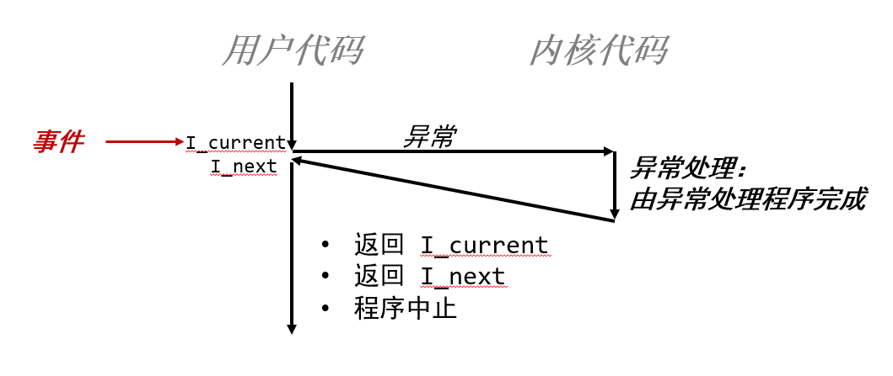
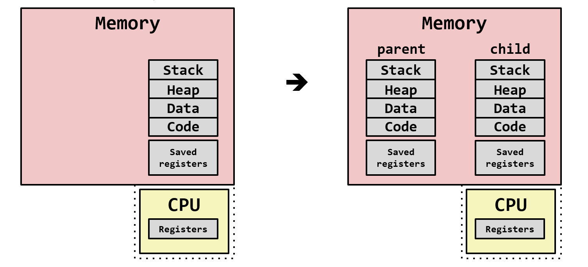

## Chapter8 异常控制流

### 异常控制流

#### 低层次

- **异常**

#### 高层次

- 进程上下文切换
- 信号
- 非本地跳转

### 异常(exception)

异常处理程序完成后，会出现下面三种情况之一。



#### 异常处理

系统会为每种类型异常分配**唯一非负整数**的异常号(exception number)，采用异常表（跳转表）的优化方式执行间接调用异常处理程序。


异常表起始地址放在**异常表基址寄存器(exception table base register)**的特殊寄存器中。

异常处理类似于过程调用，但也有不同之处：

- 过程调用：将返回地址（下一条指令）压入栈中；**异常：返回地址为当前指令或者下一条指令**
- 异常：会将额外处理器状态压入栈中，便于后续恢复程序状态
- 异常：若控制从用户程序转到内核，所有项目都压入内核栈，而不是用户栈
- 异常处理程序运行在**内核模式下**

#### 异常类别

|      类别       |          原因           | 异步/同步 |      返回行为      |            示例            |
| :-------------: | :---------------------: | :-------: | :----------------: | :------------------------: |
| 中断(interrupt) | I/O设备触发**中断引脚** |   异步    |  返回到下一条指令  | 定时器中断，内核夺取控制权 |
|   陷阱(trap)    |       有意的异常        |   同步    |  返回到下一条指令  |     系统调用(syscall)      |
|   故障(fault)   |    无意可恢复的错误     |   同步    |  可能返回当前指令  |          缺页异常          |
|   终止(abort)   |     不可恢复的错误      |   同步    | 不会返回，直接终止 |       非法的内存地址       |

- 中断(interrupt)：通过向处理器引脚发出信号，将异常号放在系统总线上，**在当前指令完成执行后（异步）**调用异常中断程序。
- 陷阱(trap)：提供系统调用，如fork,execve等，处理器提供`syscall n`指令
- 故障(fault)：如果程序能够修复这个故障，将返回，否则返回到内核中的abort，终止程序
- 终止(abort)：致命错误，终止程序

#### syscall指令


- 寄存器%rax包含系统调用号
- %rdi, %rsi, %rdx, %r10, %r8, %r9 包含最多6个参数
- 从系统调用返回时，%rax 包含返回值
- 负数返回值表明发生了错误，对应于负的 errno

**syscall与函数调用的异同**

同：

- 控制流转移，返回时执行下一条指令
- 返回值存储于%rax

异：

- syscall由内核执行
- syscall的系统调用号放在%rax
- 使用errno(全局变量)

### 进程(process)

进程为每个程序提供两个关键抽象：**逻辑控制流**（上下文切换机制提供）和**私有地址空间**（虚拟内存机制提供）。

- 如果两个进程的执行在时间上有重叠，它们就是**并发的**,否则，它们就是**顺序的**。
- 对于单核处理器，每时每刻只有一个进程在运行；不同进程执行是**交错**的，并不是真正的并发执行。

#### 私有地址空间

- 进程为每个程序提供它自己的私有地址空间
- 一般来说，和某个进程相关的内存字节不能够被其他进程读或者写。

#### 上下文切换

定义：上下文就是内核重新启动一个被抢占的进程所需的状态。

当内核选择一个新的进程运行时，就说内核**调度**了这个进程，抢占当前进程，并通过上下文切换转移到新的进程。

上下文切换：

- 保存当前进程的上下文
- 恢复某个先前被抢占的进程保存的上下文
- 将控制传递给新恢复的进程

### 系统调用错误

出错时，Linux系统级函数通常返回-1，并设置全局变量errno表示出错原因。

可以通过Stevens风格的错误处理包装函数简化代码：

```c++
void unix_error(char *msg) /* Unix-style error */
{
    fprintf(stderr, "%s: %s\n", msg, strerror(errno));//errno为全局整数变量
    exit(1);
}

pid_t Fork(void)
{
    pid_t pid;

    if ((pid = fork()) < 0)//fork返回值小于0，表明出错
        unix_error("Fork error");
    return pid;
}

```

### 进程控制

#### 获取进程ID

```c++
pid_t getpid(void);//返回当前进程的PID
pid_t getppid(void);//返回父进程的PID
```

#### 四种进程状态

- 运行(Running)
- 阻塞/睡眠(Blocked/Sleeping)
- 停止(Stopped)：进程被挂起，且不被调度，可被SIGCONT信号重新运行
- 终止/僵尸(Terminated/Zombie)：永远停止

#### 创建进程

父进程通过fork函数创建一个新的子进程。

- fork函数返回**0**给子进程，返回**子进程的PID**给父进程，**一次调用，两次返回！**
- **相同但独立的地址空间**:子进程得到与父进程用户级虚拟地址空间相同（但独立，相当于复制了一份）的副本
- **共享文件**：子进程获得与父进程任何打开文件描述符相同的副本（如stdout文件指向屏幕，子进程也将输出指向屏幕）
- 子、父进程PID不同
- 两者**并发执行，但无法预测两者执行顺序**。



示例代码：

```c++
int main(int argc, char** argv)
{
    pid_t pid;
    int x = 1;

    pid = Fork(); 
    if (pid == 0) {  /* Child */
        printf("child : x=%d\n", ++x); 
		return 0;
    }
    /* Parent */
    printf("parent: x=%d\n", --x); 
    return 0;
}
```

#### 进程图

所有的拓扑排序序列都是可行的执行序列！拓扑排序相关知识参考:[拓扑排序]([拓扑排序 - OI Wiki](https://oi-wiki.org/graph/topo/))

#### 终止进程

进程终止原因：

- 收到默认行为为终止进程的信号
- 从main程序返回
- 调用exit函数

```c++
void exit(int status)
```

- 以status退出状态终止进程
- 正常返回为0，错误时为非零
- 另一种退出状态方法是从main程序中返回一个整数值
- exit调用一次但从不返回

#### 回收子进程

当进程终止时，进程会保持终止状态，直至父进程回收它。此时这种进程成为僵尸态(zombie)，将会占用一定的系统资源。

如果父进程终止了，内核会将子进程交由**init**进程(pid=1)回收(init进程是所有进程的祖先)，但回收速度较慢。

##### waitpid函数

```c++
pid_t waitpid(pid_t pid,int *statusp,int options);
//返回：成功返回子进程PID；WNOHANG则返回0；其他错误则返回-1
//如果父进程所有子进程全部被回收，则立即返回
```

1.判定等待集合的成员(pid)

- pid>0：等待pid子进程
- pid=-1：等待该父进程的所有子进程

2.修改默认行为(options)（**了解即可**)

- WNOHANG：如果集合中任何子进程都还没终止，就立即返回
- WUNTRACED：挂起调用进程的执行，直到集合中某个进程变成已终止或者被停止
- WCONTINUED：挂起调用进程的执行，直到集合中某个正在运行的进程终止或某个被停止的进程收到SIGCONT信号继续执行
- WNOHANG|WUNTRACED：立即返回。集合中进程都没停止或者终止，返回0；如果一个子进程停止或终止，返回该子进程pid

3.检查已回收子进程的退出状态（**了解即可**)

WIFEXITED, WEXITSTATUS, WIFSIGNALED, WTERMSIG, WIFSTOPPED, WSTOPSIG, WIFCONTINUED

4.错误条件

如果调用进程无子进程，waitpid返回-1，设置errno为ECHILD。如果waitpid函数被信号中断，返回-1,设置errno为EINTR。

##### wait函数

**所等待的集合是父进程所有的子进程。**

```c++
pid_t wait(int *statusp);
```

 示例代码：

```c++
void fork9() {
    int child_status;

    if (fork() == 0) {
        printf("HC: hello from child\n");
		exit(0);//子进程终止
    } else {
        printf("HP: hello from parent\n");
        wait(&child_status);//等待子进程，终止时回收
        printf("CT: child has terminated\n");
    }
    printf("Bye\n");
}
```

```c++
void fork10() {
    pid_t pid[N];
    int i, child_status;

    for (i = 0; i < N; i++)
        if ((pid[i] = fork()) == 0) {//子进程
 			sleep(3);//休眠3秒
            exit(100+i); /* 子进程返回，退出码100+i */
        }
    for (i = 0; i < N; i++) { //父进程
        pid_t wpid = wait(&child_status);//等待某个子进程终止
        if (WIFEXITED(child_status))//正常终止
            printf("Child %d terminated with exit status %d\n",
                   wpid, WEXITSTATUS(child_status));
        else
            printf("Child %d terminate abnormally\n", wpid);//异常终止
    }
}
```

#### 休眠进程

- `unsigned int sleep(unsigned int secs);`函数可以设置进程休眠秒数，若时间已到，返回0，否则返回还剩休眠秒数。

- `int pause(void);`直接调用函数休眠，直至收到一个信号。


 


