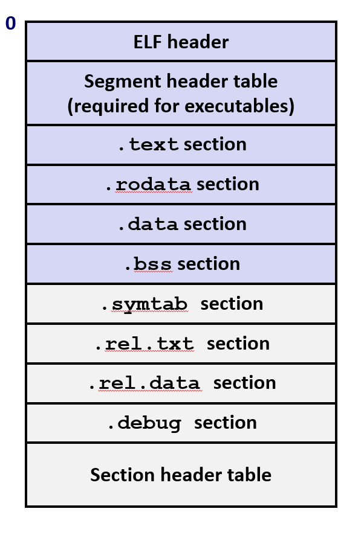
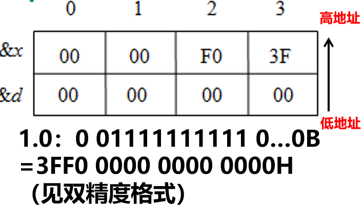
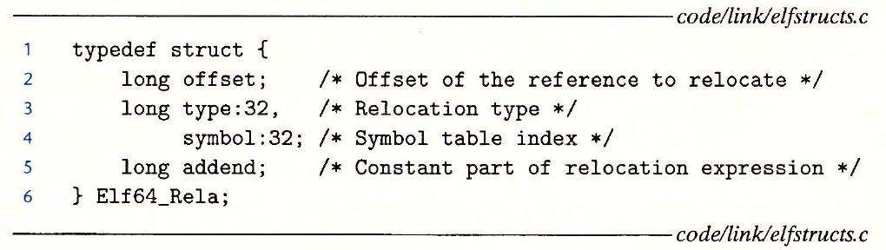
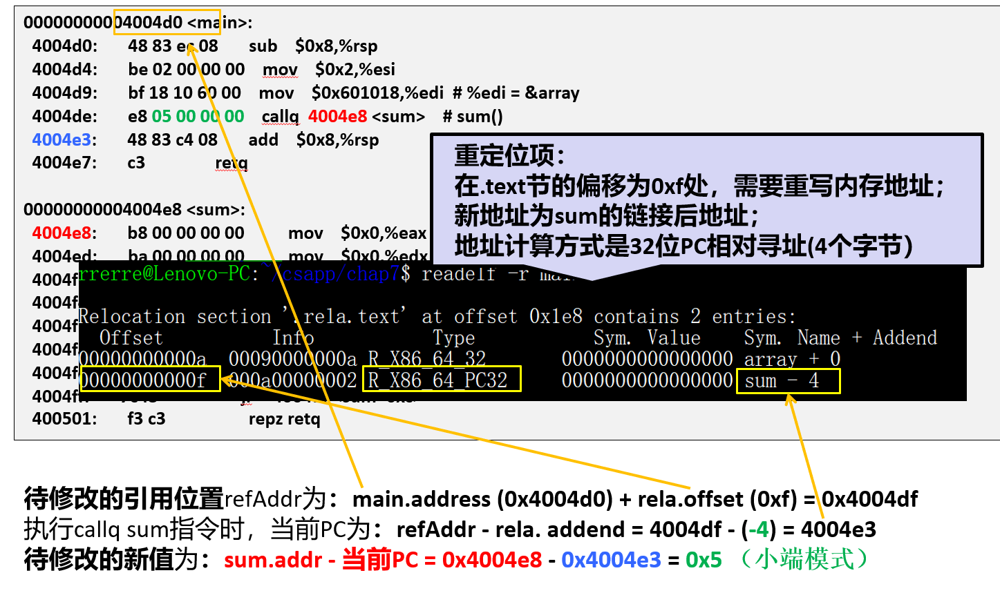
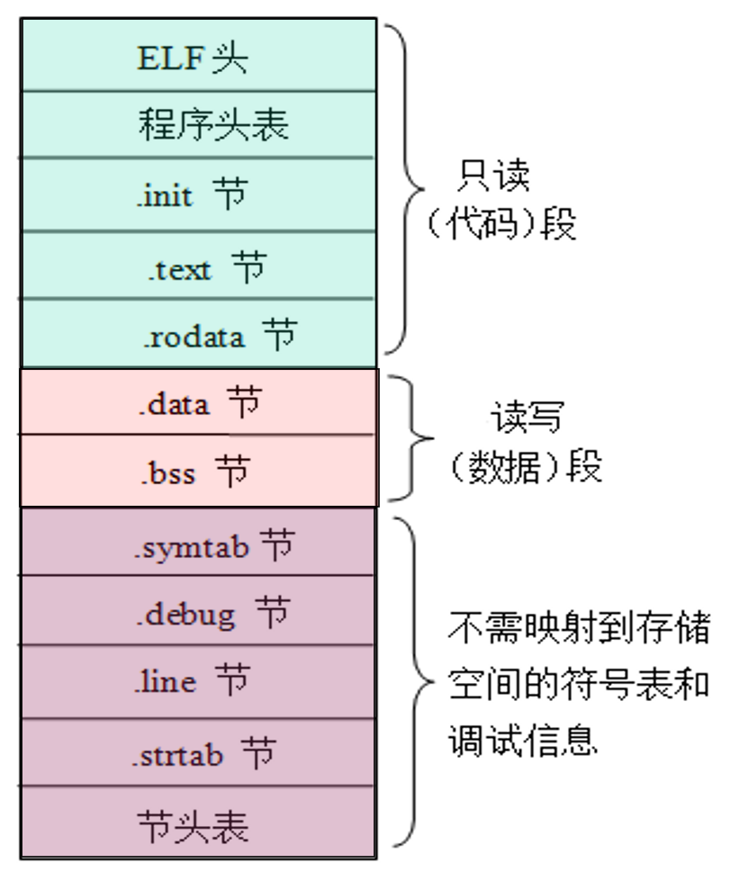

## 编译器驱动程序

**main.c -> main.i（ASCII码中间文件）-> main.s （ASCII码汇编语言文件）->main.o（可重定位目标文件）-> prog （运行链接器链接其他文件生成可执行目标文件)**

调用loader（加载器）将prog中代码和数据复制到内存，控制转移到程序开头开始运行。

## 静态链接

两个主要任务：

- **符号解析**：将符号引用和符号定义关联起来（函数，全局变量，静态变量），存储在目标文件的**符号表**中。
- **重定位**：将符号定义和内存地址关联起来，让符号的引用指向对应的内存位置。

## ELF文件（可重定位目标文件）

支持三种目标文件：

- 可重定位的目标文件 (.o)

- 可执行的目标文件 (a.out)：可直接拷贝到内存并执行

- 共享的目标文件 (.so)：可以被加载到内存进行动态链接（在加载时或者运行时完成链接），win中称为DLL

### **ELF目标文件格式**



- ELF header(ELF头):Word size 字长的大小, 字节顺序, 文件类型 (.o, exec, .so), 机器类型, etc.
- .text section：已编译程序的机器代码
- .rodata section：只读数据，如常量字符串和switch跳转表
- .data section：**初始化的全局或者静态C变量**（局部变量在栈上）
- .bss section：**未初始化的全局和静态变量，以及所有被初始化为0的全局或静态变量**
- .symtab section：符号表，存放定义和引用的函数和全局变量的信息，不包含局部变量条目
- .rel.text：text节对应的重定位信息
- .rel.data：data节对应的重定位信息
- .debug：调试符号表
- Section header table：节头表，存储了每个节的偏移和大小

## 符号和符号表

- **全局符号**：当前模块中**定义**的全局符号，可以被其他模块引用
- **外部符号**：当前模块中**引用**的全局符号，但是在其他模块中定义
- **局部符号**：当前模块中定义，且只被当前模块引用（用static修饰的C函数和全局变量），**局部链接器符号!=程序的局部符号**

## 符号解析

编译器为不是在当前模块中定义的符号生成一个**链接器符号表条目**，并交由链接器处理。

### 解决重复的符号定义

- **强符号**：函数定义，以及初始化了的全局变量
- **弱符号**：未初始化的全局变量

**链接器符号规则：**

- 不允许存在多个强符号
- 如果有1个强符号定义，和多个弱符号定义：将所有符号引用，解析到强符号定义
- 如果有多个弱符号，任意选择一个

**特别要注意下面这种情况：**

```c++
//main.c
#include <stdio.h>
int d=100;
int x=200;
void p1(void);
int main() 
{  
     p1();
     printf(“d=%d,x=%d\n”,d,x);
     return 0;
}
//p1.c
double d;
void p1(){
    d = 1.0;
}

```

这个示例中d一次强定义，一次弱定义，所有对d的引用都是指向同一个int类型的d的内存地址

而在p1.c中将d视作double类型，内存占8个字节，int类型占4个字节，赋值将会覆盖高地址变量x的内容。




全局变量的使用：

- 如果可以，请使用 **static**

- 如果你定义了一个全局变量，请初始化

- 如果你引用了外部的全局变量，请使用 **extern**

---

## 重定位

重定义由两步完成：

- 重定位节和符号定义：多文件合并、分配地址
- 重定位节中的符号引用：指向正确的运行位置

### 重定位条目



- offset：需要重定位位置的偏移量
- addend：与下一条指令（PC值）的距离
- type：分为绝对寻址和PC相对寻址

**1.PC相对寻址**

引用符号的位置（refAddr） = ADDR(s) + r.offset    节的位置+重定位位置偏移量

当前PC = refAddr - r.addend     特别注意是减号

重定位值 = r.symbol.addr - 当前PC



**2.绝对寻址**

重定位值 = ADDR(r.symbol) + r.addend

---

## 可执行目标文件

### 可执行目标文件格式



与可重定位目标文件的不同点：

- ELF头中的e_entry给出了**执行程序的第一条指令地址**
- 多了.init节，用于定义_init函数
- 少了两个.rel节，执行文件无需重定位
- 多了Program header table（**用于描述如何将节映射到存储空间**），**替换了可重定位文件中的节头表，以便加载到内存**

---

## 加载和运行

- 加载器(使用系统调用execve)将代码和数据段从磁盘文件拷贝到内存

- running the code by jumping to its entry point（定义在ELF头中）

- 跳转到文件的入口点（entry point)，开始执行

  - _start (from crt1.o, runtime)

  - _libc_start_main (from libc.so, libc)

  - main

---

## 链接共享库

### 静态链接

.a为后缀的archive包（将多个相关的可重定位目标文件串接成一个带索引的单一文件，称为archive包）。

链接过程：

- 链接器维护一个未解引用的列表，按照命令行参数顺序依次扫描是否能够找到定义
- 解析结果受**参数顺序**的影响!最佳实践: 参数顺序中，将.a文件放在.o文件的后面。

链接顺序：

按照拓扑排序顺序最佳。


### 动态链接

将这些常用函数做成一种二进制文件，其中的代码和数据可以在**加载时**或者**运行时**动态地链接到应用程序。

Linux(.so文件)、Windows(.dll文件)

- 加载时链接：在可执行文件第一次被加载时完成动态链接
- 加载时链接：在可执行文件第一次被加载时完成动态链接（软件分发，**库插桩**）
- 共享库可以被多个进程共享

---

## 库打桩机制

- 编译时打桩：将对 malloc/free 的调用宏扩展为对 mymalloc/myfree 的调用

- 链接时打桩：用--wrap f标志进行链接时打桩，把f符号解析为`_ _wrap_f`,符号`_ _real_f`解析为f

- 加载/运行时打桩：基于动态链接器的LD_PRELOAD环境变量，设置为共享库路径名列表，解析引用时先搜索LD_PRELOAD库

  
