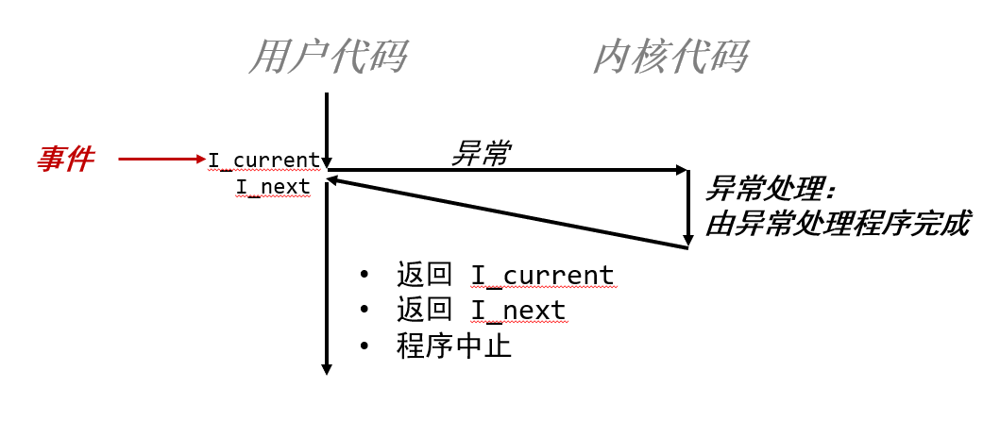
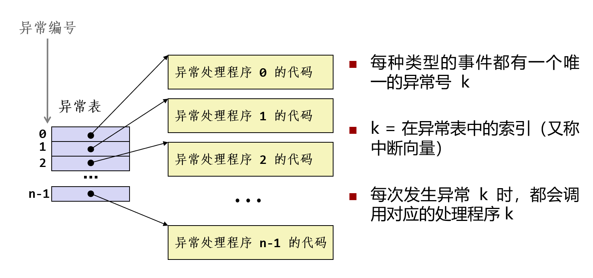
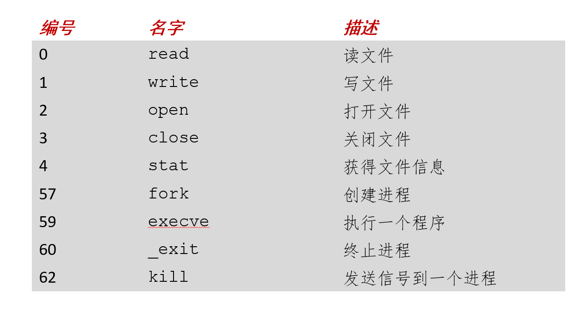
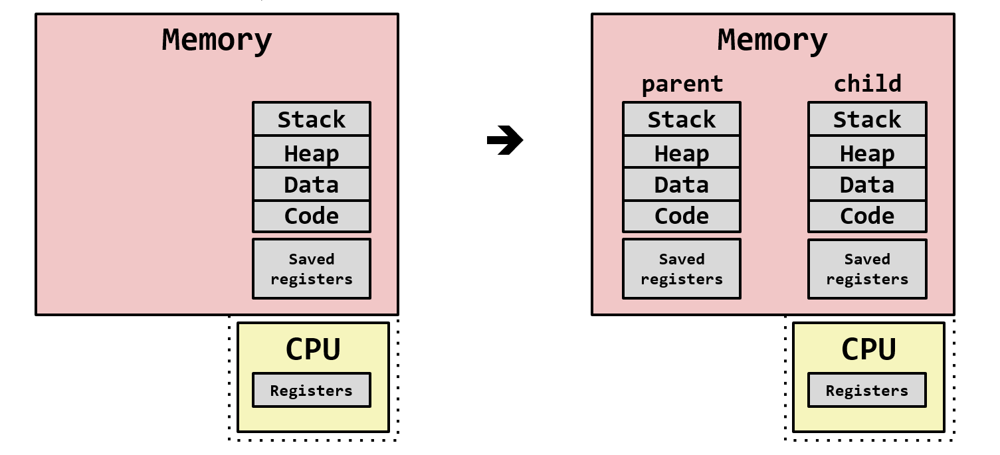
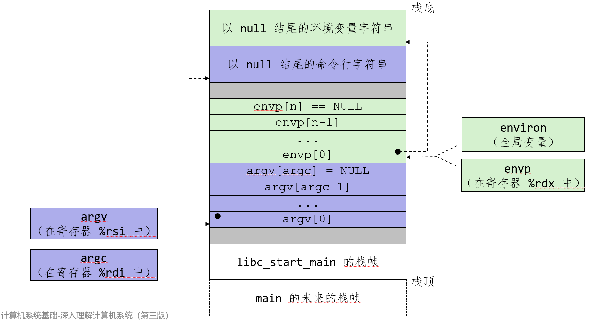
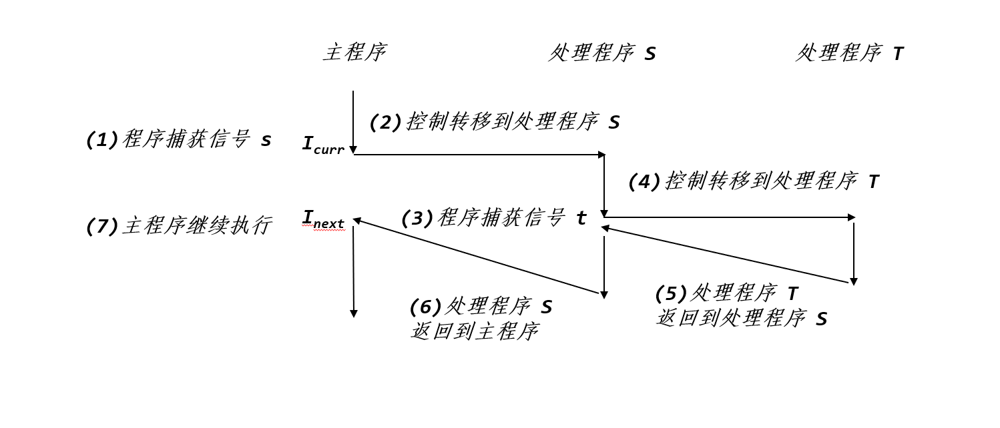
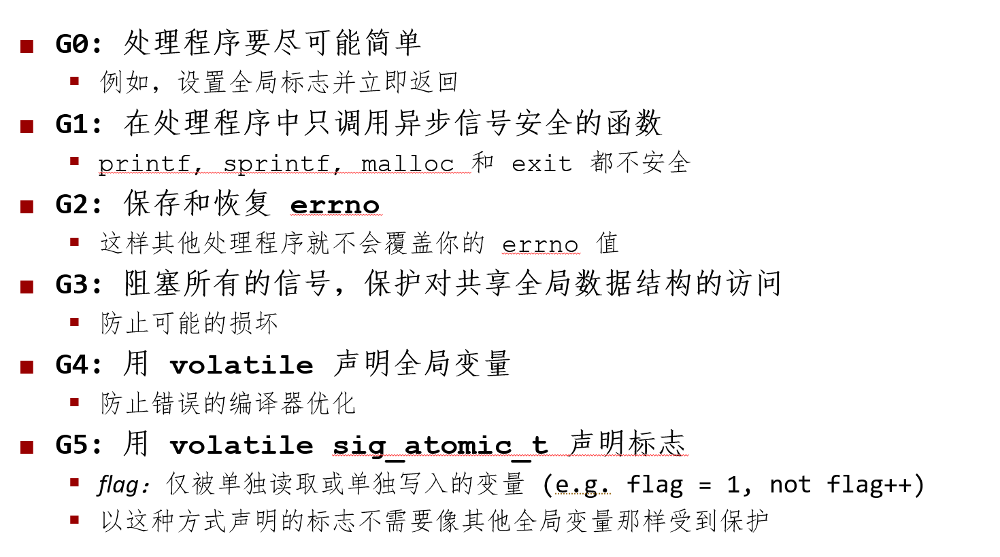

## Chapter8 异常控制流

### 异常控制流

#### 低层次

- **异常**

#### 高层次

- 进程上下文切换
- 信号
- 非本地跳转

### 异常(exception)

异常处理程序完成后，会出现下面三种情况之一。



#### 异常处理

系统会为每种类型异常分配**唯一非负整数**的异常号(exception number)，采用异常表（跳转表）的优化方式执行间接调用异常处理程序。



异常表起始地址放在**异常表基址寄存器(exception table base register)**的特殊寄存器中。

异常处理类似于过程调用，但也有不同之处：

- 过程调用：将返回地址（下一条指令）压入栈中；**异常：返回地址为当前指令或者下一条指令**
- 异常：会将额外处理器状态压入栈中，便于后续恢复程序状态
- 异常：若控制从用户程序转到内核，所有项目都压入内核栈，而不是用户栈
- 异常处理程序运行在**内核模式下**

#### 异常类别

|      类别       |          原因           | 异步/同步 |      返回行为      |            示例            |
| :-------------: | :---------------------: | :-------: | :----------------: | :------------------------: |
| 中断(interrupt) | I/O设备触发**中断引脚** |   异步    |  返回到下一条指令  | 定时器中断，内核夺取控制权 |
|   陷阱(trap)    |       有意的异常        |   同步    |  返回到下一条指令  |     系统调用(syscall)      |
|   故障(fault)   |    无意可恢复的错误     |   同步    |  可能返回当前指令  |          缺页异常          |
|   终止(abort)   |     不可恢复的错误      |   同步    | 不会返回，直接终止 |       非法的内存地址       |

- 中断(interrupt)：通过向处理器引脚发出信号，将异常号放在系统总线上，**在当前指令完成执行后（异步）**调用异常中断程序。
- 陷阱(trap)：提供系统调用，如fork,execve等，处理器提供`syscall n`指令
- 故障(fault)：如果程序能够修复这个故障，将返回，否则返回到内核中的abort，终止程序
- 终止(abort)：致命错误，终止程序

#### syscall指令

linux系统中的系统调用号：



- 寄存器%rax包含系统调用号
- %rdi, %rsi, %rdx, %r10, %r8, %r9 包含最多6个参数
- 从系统调用返回时，%rax 包含返回值
- 负数返回值表明发生了错误，对应于负的 errno

**syscall与函数调用的异同**

同：

- 控制流转移，返回时执行下一条指令
- 返回值存储于%rax

异：

- syscall由内核执行
- syscall的系统调用号放在%rax
- 使用errno(全局变量)

---

### 进程(process)

进程为每个程序提供两个关键抽象：**逻辑控制流**（上下文切换机制提供）和**私有地址空间**（虚拟内存机制提供）。

- 如果两个进程的执行在时间上有重叠，它们就是**并发的**,否则，它们就是**顺序的**。
- 对于单核处理器，每时每刻只有一个进程在运行；不同进程执行是**交错**的，并不是真正的并发执行。

#### 私有地址空间

- 进程为每个程序提供它自己的私有地址空间
- 一般来说，和某个进程相关的内存字节不能够被其他进程读或者写。

#### 上下文切换

定义：上下文就是内核重新启动一个被抢占的进程所需的状态。

当内核选择一个新的进程运行时，就说内核**调度**了这个进程，抢占当前进程，并通过上下文切换转移到新的进程。

上下文切换：

- 保存当前进程的上下文
- 恢复某个先前被抢占的进程保存的上下文
- 将控制传递给新恢复的进程

---

### 系统调用错误

出错时，Linux系统级函数通常返回-1，并设置全局变量errno表示出错原因。

可以通过Stevens风格的错误处理包装函数简化代码：

```c++
void unix_error(char *msg) /* Unix-style error */
{
    fprintf(stderr, "%s: %s\n", msg, strerror(errno));//errno为全局整数变量
    exit(1);
}

pid_t Fork(void)
{
    pid_t pid;

    if ((pid = fork()) < 0)//fork返回值小于0，表明出错
        unix_error("Fork error");
    return pid;
}

```

---

### 进程控制

#### 获取进程ID

```c++
pid_t getpid(void);//返回当前进程的PID
pid_t getppid(void);//返回父进程的PID
```

#### 四种进程状态

- 运行(Running)
- 阻塞/睡眠(Blocked/Sleeping)
- 停止(Stopped)：进程被挂起，且不被调度，可被SIGCONT信号重新运行
- 终止/僵尸(Terminated/Zombie)：永远停止

#### 创建进程

父进程通过fork函数创建一个新的子进程。

- fork函数返回**0**给子进程，返回**子进程的PID**给父进程，**一次调用，两次返回！**
- **相同但独立的地址空间**:子进程得到与父进程用户级虚拟地址空间相同（但独立，相当于复制了一份）的副本
- **共享文件**：子进程获得与父进程任何打开文件描述符相同的副本（如stdout文件指向屏幕，子进程也将输出指向屏幕）
- 子、父进程PID不同
- 两者**并发执行，但无法预测两者执行顺序**。



示例代码：

```c++
int main(int argc, char** argv)
{
    pid_t pid;
    int x = 1;

    pid = Fork(); 
    if (pid == 0) {  /* Child */
        printf("child : x=%d\n", ++x); 
		return 0;
    }
    /* Parent */
    printf("parent: x=%d\n", --x); 
    return 0;
}
```

#### 进程图

所有的拓扑排序序列都是可行的执行序列！拓扑排序相关知识参考:[拓扑排序]([拓扑排序 - OI Wiki](https://oi-wiki.org/graph/topo/))

#### 终止进程

进程终止原因：

- 收到默认行为为终止进程的信号
- 从main程序返回
- 调用exit函数

```c++
void exit(int status)
```

- 以status退出状态终止进程
- 正常返回为0，错误时为非零
- 另一种退出状态方法是从main程序中返回一个整数值
- exit调用一次但从不返回

#### 回收子进程

当进程终止时，进程会保持终止状态，直至父进程回收它。此时这种进程成为僵尸态(zombie)，将会占用一定的系统资源。

如果父进程终止了，内核会将子进程交由**init**进程(pid=1)回收(init进程是所有进程的祖先)，但回收速度较慢。

##### waitpid函数

```c++
pid_t waitpid(pid_t pid,int *statusp,int options);
//返回：成功返回子进程PID；WNOHANG则返回0；其他错误则返回-1
//如果父进程所有子进程全部被回收，则立即返回
```

1.判定等待集合的成员(pid)

- pid>0：等待pid子进程
- pid=-1：等待该父进程的所有子进程

2.修改默认行为(options)（**了解即可**)

- WNOHANG：如果集合中任何子进程都还没终止，就立即返回
- WUNTRACED：挂起调用进程的执行，直到集合中某个进程变成已终止或者被停止
- WCONTINUED：挂起调用进程的执行，直到集合中某个正在运行的进程终止或某个被停止的进程收到SIGCONT信号继续执行
- WNOHANG|WUNTRACED：立即返回。集合中进程都没停止或者终止，返回0；如果一个子进程停止或终止，返回该子进程pid

3.检查已回收子进程的退出状态（**了解即可**)

WIFEXITED, WEXITSTATUS, WIFSIGNALED, WTERMSIG, WIFSTOPPED, WSTOPSIG, WIFCONTINUED

4.错误条件

如果调用进程无子进程，waitpid返回-1，设置errno为ECHILD。如果waitpid函数被信号中断，返回-1,设置errno为EINTR。

##### wait函数

**所等待的集合是父进程所有的子进程。**

```c++
pid_t wait(int *statusp);
```

 示例代码：

```c++
void fork9() {
    int child_status;

    if (fork() == 0) {
        printf("HC: hello from child\n");
		exit(0);//子进程终止
    } else {
        printf("HP: hello from parent\n");
        wait(&child_status);//等待子进程，终止时回收
        printf("CT: child has terminated\n");
    }
    printf("Bye\n");
}
```

```c++
void fork10() {
    pid_t pid[N];
    int i, child_status;

    for (i = 0; i < N; i++)
        if ((pid[i] = fork()) == 0) {//子进程
 			sleep(3);//休眠3秒
            exit(100+i); /* 子进程返回，退出码100+i */
        }
    for (i = 0; i < N; i++) { //父进程
        pid_t wpid = wait(&child_status);//等待某个子进程终止
        if (WIFEXITED(child_status))//正常终止
            printf("Child %d terminated with exit status %d\n",
                   wpid, WEXITSTATUS(child_status));
        else
            printf("Child %d terminate abnormally\n", wpid);//异常终止
    }
}
```

#### 休眠进程

- `unsigned int sleep(unsigned int secs);`函数可以设置进程休眠秒数，若时间已到，返回0，否则返回还剩休眠秒数。

- `int pause(void);`直接调用函数休眠，直至收到一个信号。

#### 加载并运行程序

`execve`函数在**当前进程**(相当于替换当前进程)的上下文加载并运行一个新程序,**调用一次且从不返回（除非有错误）**。

```c++
int execve(const char *filename,const char *argv[],const char *envp[]);
//成功不返回，错误返回-1
```

- filename:可执行文件，argv：带参数列表（**argv[0]=filename，argv以null结尾**)，envp：环境变量列表(**以null结尾，是name=value的键值对**)
- 覆盖原进程的代码段、数据段和栈，保留PID、打开的文件和信号上下文

 

- argc给出argv[]数组中非空指针的数量
- argv指向argv[]数组中第一个条目
- environ指向envp[]数组中的第一个条目

### Shell程序

一个简单shell程序的main函数示例：

```c++
#include "csapp.h"
#define MAXARGS   128

/* Function prototypes */
void eval(char *cmdline);
int parseline(char *buf, char **argv);
int builtin_command(char **argv); 

int main() 
{
    char cmdline[MAXLINE]; /* 输入命令行 */

    while (1) {
        /* 循环读取*/
        printf("> ");                   
        Fgets(cmdline, MAXLINE, stdin); //通过Fgets获取一行输入，MAXLINE可以防止缓存区溢出
        if (feof(stdin))
            exit(0);
        /* 处理命令 */
        eval(cmdline);
    } 
}
```

eval函数示例:

```c++
void eval(char *cmdline) 
{
    char *argv[MAXARGS]; /* Argument list execve() 带参数列表 */
    char buf[MAXLINE];   /* Holds modified command line 保存了分隔处理后的输入命令*/
    int bg;              /* 作业在前台还是后台运行 */
    pid_t pid;           /* Process id 进程号 */
    
    strcpy(buf, cmdline);//将cmdline先复制到buf中
    bg = parseline(buf, argv); //调用parseline分隔处理命令并返回前台还是后台运行进程
    if (argv[0] == NULL)  
		return;   /* 空命令(filename为空)直接返回 */

    if (!builtin_command(argv)) { //返回0则创建一个子进程
        if ((pid = Fork()) == 0) {   /* 如果为子进程 */
            if (execve(argv[0], argv, environ) < 0) {//如果无法找到该命令
                printf("%s: Command not found.\n", argv[0]);
                exit(0);//终止子进程
            }
        }

	/* 父进程等待子进程终止回收 */
	if (!bg) {//前台运行
	    int status;
	    if (waitpid(pid, &status, 0) < 0)
			unix_error("waitfg: waitpid error");
	}
	else //后台运行，无需等待子进程终止,注意这里无法回收后台运行的子进程，变为僵尸进程！！！
	    printf("%d %s", pid, cmdline);
    }
    return;
}

/* 如果第一个参数是内置命令，请运行它并返回true */
int builtin_command(char **argv) 
{
    if (!strcmp(argv[0], "quit")) /* quit command */
		exit(0);  
    if (!strcmp(argv[0], "&"))    /* 如果输入的是单独的&,返回1，不创建子进程*/
		return 1;
    return 0;                     /* 不是一个内置的命令，创建子进程执行*/
}
```

```c++
int parseline(char *buf, char **argv) 
{
    char *delim;         /* 指向第一个空格分隔符 */
    int argc;            /* argv中非空指针的数量 */
    int bg;              /* 是否为后台运行进程 */

    buf[strlen(buf)-1] = ' ';  /* 代替'\n'为空格 */
    while (*buf && (*buf == ' ')) /* 忽略前置空格 */
	buf++;

    /* 创建argv列表*/
    argc = 0;
    while ((delim = strchr(buf, ' '))) {// 查找下一个空格
		argv[argc++] = buf;// 存储当前参数
		*delim = '\0';// 用 '\0' 替换空格,标记字符串结束,使 argv[argc] 成为合法字符串
		buf = delim + 1;// 移动到下一个参数，从当前空格第二个字符开始
		while (*buf && (*buf == ' ')) /* 忽略空格 */
            buf++;
    }
    argv[argc] = NULL; // argv 必须以 NULL 结尾
    
    if (argc == 0)  /* 忽略空白命令行 */
	return 1;

    /* 是否后台运行，有&结尾则是后台运行 */
    if ((bg = (*argv[argc-1] == '&')) != 0)
	argv[--argc] = NULL;

    return bg;
}
```

---

### 信号

信号由内核发送（有时由其他进程请求）到目标进程，Linux系统支持30种信号。

- 发送信号：**内核检测到了一个系统事件或者一个进程调用了kill函数，显示发送一个信号给目标进程（可以发送给自己）**
- 接收信号：目的进程被内核强迫以某种方式对信号作出反应
- 一个发出而没有接收的信号叫做**待处理(pending)**信号
- 任何时刻，**每个种类至多只有一个待处理信号**，其余发送的信号都将被丢弃而不会排队，可以利用这种机制有选择性地阻塞接受某种信号
- 一个进程可以**阻塞**接收某种信号，一个待处理信号最多只能被接受一次

#### Pending，blocked位向量（信号掩码）

内核维护每个进程的上下文中的**pending** **和** **blocked** 位向量

- pending：待处理信号集合
  - 只要传递了一个类型为 k 的信号，内核就会设置 **pending** 中的第 k 位
  - 只要接收了一个类型为 k 的信号，内核就会清除 **pending** 中的第 k 位
- blocked：阻塞信号集合，可以通过sigprocmask函数设置或者清除这些位

#### 发送信号

##### 进程组

每个进程都只属于一个进程组。由一个正整数进程组ID标识。

```c++
pid_t getpgrp(void);//函数返回调用进程的进程组ID
```

**默认情况，子进程与父进程同属于一个进程组**，但也可以通过`setpgid`函数来改变进程组。

```c++
int setpgid(pid_t pid,pid_t pgid);//若成功返回0，错误返回-1
```

将进程pid的进程组改为pgid。**若pid=0,则使用当前进程的pid；若pgid=0，则用pid指定的进程PID作为进程组ID。**

例如：进程15213调用setpgid(0,0)，则会创建一个进程组ID为15213的进程组，并将进程15213加入这个进程组中。

##### /bin/kill 程序发送信号

`/bin/kill -9 ID`

信号9为SIGKILL。若ID>0 则杀死进程ID，若ID<0，则杀死进程组ID中的所有进程。

##### 从键盘发送信号

同一时刻，至多只有一个前台作业(**job**)和0/多个后台作业。同一个前台作业可以**包含1个或者多个进程，它们的进程组ID都相同**。

**键入** **ctrl-c (ctrl-z)**会导致内核发送 **SIGINT**（**SIGTSTP**）信号到前台进程组中的每个作业

- SIGINT默认终止每个进程
- SIGTSTP默认停止/暂停每个进程

##### kill函数发送信号

```c++
int kill(pid_t pid , int sig);//成功返回0，错误返回-1
```

- pid>0：发送信号号码sig给进程pid
- pid=0：发送信号sig给调用进程所在进程组中的所有进程（包括调用进程）
- pid<0：发送信号给进程组|pid|中的每个进程

##### alarm函数发送信号（上课未讲）

```c++
unsigned int alarm(unsigned int secs);//返回前一次闹钟剩余秒数，若未设定闹钟，则返回0
```

`alarm`函数安排内核在secs秒后发送一个SIGALRM信号给调用进程。

对alarm的调用将取消任何待处理（pending）闹钟，并且返回任何待处理的闹钟在被发送前还剩的秒数（无待处理闹钟则返回0）。

#### 接受信号

内核把进程p**从内核模式切换到用户模式**时，会检测进程p的未被阻塞的待处理信号集合。若集合非空，则会选取某个信号k（通常为最小的k），并强制进程p接受信号k，完成接收后继续p的逻辑控制流的下一条指令。（**也就是说每次只会接受一个信号**）

##### 信号的默认行为（系统预设）：

- 忽略信号
- 终止进程
- 终止进程并转储内存
- 进程停止直到被SIGCONT信号重启

##### 接收信号可能反应方式

- 忽略信号
- 终止进程（可能转储内存）
- 捕获信号，执行**信号处理程序**

##### 自定义信号行为

SIGSTOP和SIGKILL这两个信号无法修改默认行为。

```c++
sighandler_t signal(int signum , sighandler_t handler);
//若成功返回前次处理程序指针，出错则为SIG_ERR(不设置errno)
```

handler不同取值：

- SIG_IGN：忽略signum信号。
- SIG_DFL：signum信号恢复默认行为。
- 其他情况：handler为用户定义的**信号处理程序**地址，把处理程序传给signal函数行为叫做**设置信号处理程序**，调用信号处理程序叫做**捕获信号**，执行信号处理程序叫做**处理信号**。
- 当信号处理程序执行return语句时，控制传递回控制流中进程被中断位置的指令（**就是会从接受信号的地方继续执行**）。

```c++
void sigint_handler(int sig) /* 自定义信号处理程序*/
{
    printf("So you think you can stop the bomb with ctrl-c, do you?\n");
    sleep(2);
    printf("Well...");
    fflush(stdout);
    sleep(1);
    printf("OK. :-)\n");
    exit(0);
}

int main()
{
    /* Install the SIGINT handler */
    if (signal(SIGINT, sigint_handler) == SIG_ERR)//当用户按下Ctrl+C后内核发送SIGINT信号
        unix_error("signal error");

    /* Wait for the receipt of a signal */
    pause();

    return 0;
}

```

- **信号处理程序可以被其他信号处理程序中断（即可以嵌套）**



#### 阻塞和接触信号

**隐式阻塞机制**：内核默认阻塞任何当前处理程序**正在处理信号类型的待处理信号**。例如，一个 SIGINT 处理程序不会被另一个 SIGINT 信号中断。

**显式阻塞机制**：使用**sigprocmask**函数和它的辅助函数明确地阻塞和接触阻塞选定的信号。

```c++
int sigprocmask(int how,const sigset_t *set,sigset_t *oldset);
int sigemptyset(sigset_t *set);//初始化为空集合
int sigfillset(sigset_t *set);//将所有信号编号添加到集合中
int sigaddset(sigset_t *set,int signum);//将特定信号编号添加到集合中
int sigdelset(sigset_t *set,int signum);//从集合中删除特定信号编号
//成功返回0，出错返回-1
int sigismember(const sigset_t *set,int signum);//是否是集合中的成员
//若signum是set的成员则为1，如果不是则为0，出错为-1
```

how的值:

- SIG_BLOCK:将set中的信号添加到blocked中
- SIG_UNBLOCK:将blocked中删除set中的信号
- SIG_SETMASK:block=set

如果oldset非空，那么**blocked位向量（也称为信号掩码）**之前的值保存在oldset中。

用sigprocmask来临时阻塞接受SIGINT信号代码示例：

```c++
sigset_t mask, prev_mask;

Sigemptyset(&mask);//将mask集合初始化为空
Sigaddset(&mask, SIGINT);//添加SIGINT信号进入mask集合

/* 阻塞SIG_INT信号，并将blocked位向量保存在prev_mask集合中 */
Sigprocmask(SIG_BLOCK, &mask, &prev_mask);

/* 该代码区域将不会被SIG_INT信号中断 */

/* 恢复block=prev_mask，解除阻塞SIG_INT信号 */
Sigprocmask(SIG_SETMASK, &prev_mask, NULL);

```

#### 安全的信号处理（了解即可）

教材8.5.5节有详细说明，期末考试不涉及。



#### 正确的信号处理

未处理的信号不排队，直接舍弃，每种类型最多只能有一个未处理的信号，所以**不能用信号对其他进程中发生的事件计数，如子进程终止的次数**。

必须等待所有终止的子进程，使用wait回收所有已终止的子进程！

#### 可移植的信号处理

sigaction函数：

```c++
int sigaction(int signum, struct sigaction *act,struct sigaction *oldact);
//成功返回0，错误返回-1
```

用户可以明确指定信号处理语义，但我们一般使用Signal包装函数。

#### 同步流

利用原子锁，确保一个事务的原子性，用信号的阻塞机制。先lock，再工作，再unlock。

```c++
#include "csapp.h"

void initjobs()
{
}

void addjob(int pid)
{
}

void deletejob(int pid)
{
}

void handler(int sig)
{
    int olderrno = errno;
    sigset_t mask_all, prev_all;
    pid_t pid;

    Sigfillset(&mask_all);//阻塞所有信号
    while ((pid = waitpid(-1, NULL, 0)) > 0) { /* 进程终止 */
        Sigprocmask(SIG_BLOCK, &mask_all, &prev_all);//阻塞所有信号
        deletejob(pid); /* 删除列表 */
        Sigprocmask(SIG_SETMASK, &prev_all, NULL);//block = prev_all
    }
    if (errno != ECHILD)
        Sio_error("waitpid error");
    errno = olderrno;
}
    
int main(int argc, char **argv)
{
    int pid;
    sigset_t mask_all, mask_one, prev_one;

    Sigfillset(&mask_all);//将所有信号添加到集合mask_all中
    Sigemptyset(&mask_one);//设置空集合
    Sigaddset(&mask_one, SIGCHLD);//添加SIGCHLD信号
    Signal(SIGCHLD, handler);//绑定SIGCHLD信号到信号处理程序handler
    initjobs(); /* 初始化作业列表 */
    /*
    	阻塞子进程发的信号，先addjob,再解除阻塞，接收子进程发的信号，deletejob。
    */
    while (1) {
        Sigprocmask(SIG_BLOCK, &mask_one, &prev_one); /* 阻塞SIG_CHLD信号 */
        if ((pid = Fork()) == 0) { /* 如果是子进程中 */
            Sigprocmask(SIG_SETMASK, &prev_one, NULL); /* 解除阻塞SIG_CHLD信号，子进程会继承父进程的阻塞列表 */
            Execve("/bin/date", argv, NULL);//execve执行替换自身进程
        }
        Sigprocmask(SIG_BLOCK, &mask_all, NULL); /* 父进程，阻塞所有信号，不接收子进程发来的SIG_CHLD信号 */  
        addjob(pid);  /* 先添加到作业列表中 */
        Sigprocmask(SIG_SETMASK, &prev_one, NULL);  /* 解除阻塞 SIGCHLD 信号*/
    }
    exit(0);
}
/* $end procmask2 */
```

#### 显示等待信号

几种显式等待信号的方式：

1.while轮询

```c++
while(!pid)
    ;
```

程序正确但太浪费系统资源。

2.sleep休眠函数

```c++
while(!pid)
    sleep(1);
```

每次等待1秒再查询检测，无法及时检测信号。

3.pause()函数

```c++
while(!pid)
    pause();
```

- 当`!pid`为真时（即pid还是0），准备进入pause()
- 但就在这之间（检查pid后，调用pause前），子进程终止并发送了SIGCHLD信号
- 由于pause()尚未被调用，信号会被直接处理（假设有SIGCHLD处理程序）
- 然后当pause()最终被调用时，再也没有新的信号来唤醒它

**4.sigsuspend函数**

```c++
int sigsuspend(const sigset_t *mask);
//相当于原子版本：
sigprocmask(SIG_BLOCK,&mask,&prev);//注意就是SIG_BLOCK
pause();
sigprocmask(SIG_SETMASK,&prev,NULL);
```

- **sigsuspend相当于sigprocmask（第三行）和pause函数（第四行）同时执行（原子性），消除潜在竞争。**

下面是一个利用sigsuspend函数来等待信号的示例：

```c++
#include "csapp.h"

volatile sig_atomic_t pid;

void sigchld_handler(int s)
{
    int olderrno = errno;
    pid = Waitpid(-1, NULL, 0);
    errno = olderrno;
}

void sigint_handler(int s)
{
}

int main(int argc, char **argv) 
{
    sigset_t mask, prev;//两个集合

    Signal(SIGCHLD, sigchld_handler);//绑定信号处理程序
    Signal(SIGINT, sigint_handler);//绑定信号处理程序
    Sigemptyset(&mask);//设置mask集合为空
    Sigaddset(&mask, SIGCHLD);//加入SIGCHLD到mask集合

    while (1) {
        Sigprocmask(SIG_BLOCK, &mask, &prev); /* 阻塞 SIGCHLD，防止在Sigsuspend之前SIGCHLD信号到达 */
        if (Fork() == 0) /* 子进程 */
            exit(0);

        /* 等待SIGCHLD信号接收*/
        pid = 0;//设置pid=0
        while (!pid) //pid=0时进入
            Sigsuspend(&prev);//注意传入的参数是prev
        /*Sigsuspend可以等效为下列代码：
        	sigprocmask(SIG_SETMASK,&prev,&prev_2); prev为不包含SIGCHLD的集合，解除阻塞
			pause(); 临时打开了SIGCHLD信号，允许接收SIGCHLD信号
			sigprocmask(SIG_SETMASK,&prev_2,NULL);	再次阻塞SIGCHLD信号
        */

        /* 解除阻塞 SIGCHLD */
        Sigprocmask(SIG_SETMASK, &prev, NULL); 

        /* Do some work after receiving SIGCHLD */
        printf(".");
    }
    exit(0);
}
```

---

### 非本地跳转

可以将控制从一个函数转到另一个正在执行的函数，无需经过正常调用-返回。通过**setjmp**和**longjmp**函数实现的。

```c++
int setjmp(jmp_buf env);
int sigsetjmp(sigjmp_buf env,int savesigs);
//返回0
```

- 在调用**longjmp之前**调用，标识后续longjmp的**返回位置**。
- 调用**一次**，返回**一次或者多次**。
- 实现机制：将当前**寄存器上下文、栈指针和程序计数器**存储在跳转缓冲区 **env** 中，从而记录当前位置
- 注意不可以用变量接收返回值，但可以使用switch或者条件语句的测试条件

```c++
void longjmp(jmp_buf env,int retval);
void siglongjmp(sigjmp_buf env,int retval);
```

- 跳转到缓冲区env的setjmp函数处，并且setjmp函数**返回retval**而不是0
- 调用**一次**，从不返回
- 实现机制：从跳转缓冲区env中恢复**寄存器上下文、栈指针、基指针和程序计数器**，将**%eax**（返回值寄存器）设置为 **retval**，跳转到跳转缓冲区env中的setjmp函数处。

非本地跳转代码示例：

```c++
#include "csapp.h"

jmp_buf buf;

int error1 = 0; 
int error2 = 1;

void foo(void), bar(void);

int main() 
{
    switch(setjmp(buf)) {
    case 0: //初次调用保存buf时返回值默认为0，调用foo()函数
	foo();
        break;
    case 1: //foo中返回
		printf("Detected an error1 condition in foo\n");
        break;
    case 2: //bar中返回
		printf("Detected an error2 condition in foo\n");
        break;
    default:
		printf("Unknown error condition in foo\n");
    }
    exit(0);
}

/* Deeply nested function foo */
void foo(void) 
{
    if (error1)
		longjmp(buf, 1); //回到buf中的setjmp处，并且setjmp返回1
    bar();
}

void bar(void) 
{
    if (error2)
		longjmp(buf, 2); //回到buf中的setjmp处，并且setjmp返回2
}
```

一个restart程序示例：
```c++
#include "csapp.h"

sigjmp_buf buf;

void handler(int sig) 
{
    siglongjmp(buf, 1);//程序接收到SIGINT信号后，返回到sigsetjmp处，进入重启状态
}

int main() 
{
    if (!sigsetjmp(buf, 1)) {//如果是第一次调用sigsetjmp，设置buf并且绑定信号到handler
        Signal(SIGINT, handler);//更改SIGINT的默认行为
		Sio_puts("starting\n");
    }
    else //其他时候从siglongjmp返回到sigsetjmp，重启状态
		Sio_puts("restarting\n");

    while(1) {
		Sleep(1);
        Sio_puts("processing...\n");
    }
    exit(0); /* Control never reaches here */
}
```


