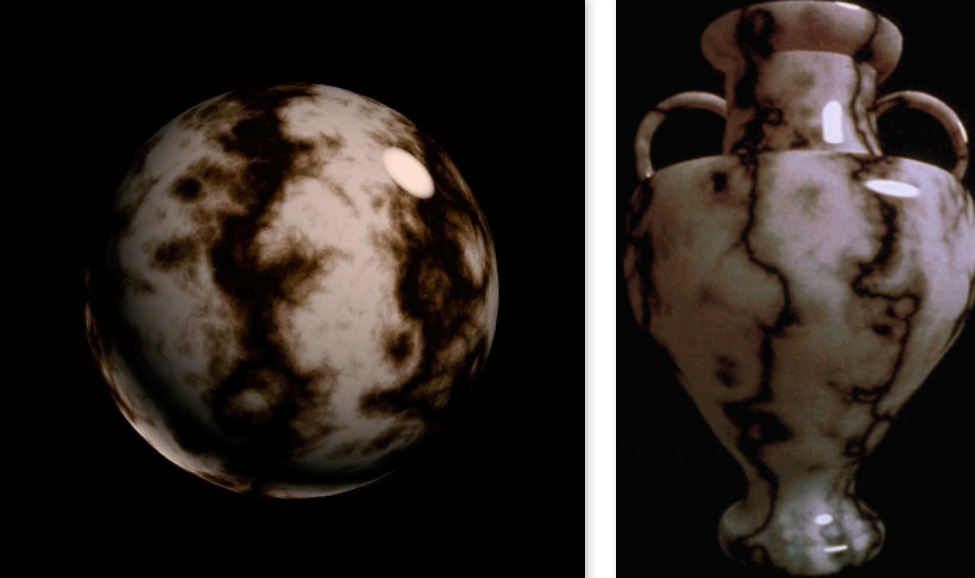
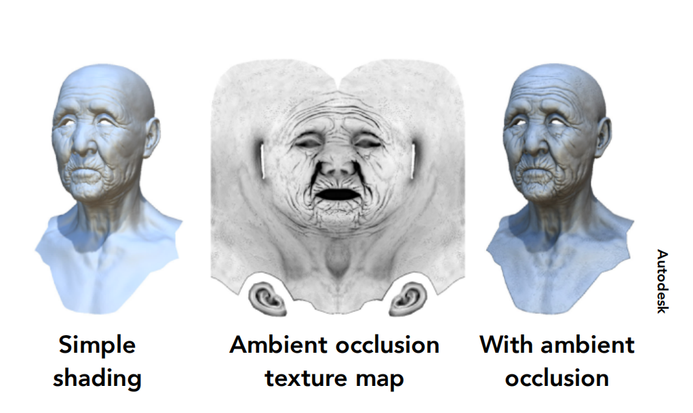

## Applications of Textures

### Environment Map

我们可以将环境光做成贴图贴在物体的表面，实现物体反射环境光的效果。

### Spherical Environment Map（球形环境贴图）

将环境光贴图映射到一个球上，问题在于靠近极点的上下两侧会发生扭曲现象。

### Cube Map

将环境光映射到一个立方体六个面上，解决了Spherical Environment Map扭曲的问题。当我们要查询来自某个方向的光线时，需要先求出信息记录在立方体哪个表面上。

纹理不仅可以用来表示颜色，还可以表示表面凹凸程度。贴图存储相对高度，欺骗人眼认为表面有凹凸变化，几何形体并没有发生实际的形状变化！

### Bump Mapping

通过改变相对高度来改变法线方向，而不会增加更多的几何形体。

如何找到法线方向？借助切线方向即可找到！

二维情况：

三维情况：

### Displacement mapping(位移贴图)

凹凸贴图或者法线贴图在边缘无法表现凹凸，且无法表示物体局部凸起对于其他部分的阴影。我们可以用到Displacement mapping，它真正地移动了顶点，而不仅仅只是计算出了法线。

位移贴图要求模型本身的三角形足够细致，便于凹凸纹理变化三角形的顶点位置！

如果三角形较少的粗糙模型需要使用位移贴图，就要使用到dynamic tessellation（动态曲面细分），在应用位移贴图的过程中检测是否需要将三角形细分。

### 3D Procedural Noise + Solid Modeling

定义空间中的噪声函数，可以计算出空间中任意一个点的噪声值，通过一系列的操作将二维纹理映射到空间中。

### Provide Precomputed Shading

如下图，纹理还可以预先计算环境光遮蔽，加快渲染速度。

## Geometry

### Two ways to represent geometry

#### Implicit(隐式的)

不显示说明每个点具体在哪里，只告诉这些点满足的关系，所有满足f(x,y,z)=0的点构成的几何体。

例如球的隐式表达：$x^2+y^2+z^2=1$ 

采样所有的点是困难的，但是可以简单地检测点是在几何内部还是外部

#### Explicit（显式的）

将关于x,y,z的函数转为u,v 的函数->参数方程

采样所有的点是容易的，但是检测一个点是在内部还是外部是困难的。

### More Implicit Representations in Computer Graphics

#### Constructive Solid Geometry(CSG)

在计算机图形学中隐式表示几何体还可以使用交、并、补布尔运算。

#### Distance Functions

求出一个点到物体表面的最短距离 ，距离为正在物体外，为负在物体内。A、B是两个不同的图，我们可以用距离函数来解决这个问题，SDF(A)， SDF(B) 物体边界处的值接近0，blend 两个距离函数相当于是在blend两个物体的边界，最后再把blend(SDF(A),SDF(B))恢复成物体，为0表示边界。

### Level Set Methods（水平集）

如果距离函数的表达式不好写，可以使用水平集来表达距离函数，存储在一个矩阵当中，边界就是值为0的点的集合（可以使用插值方法计算出任何一个点的值）。

