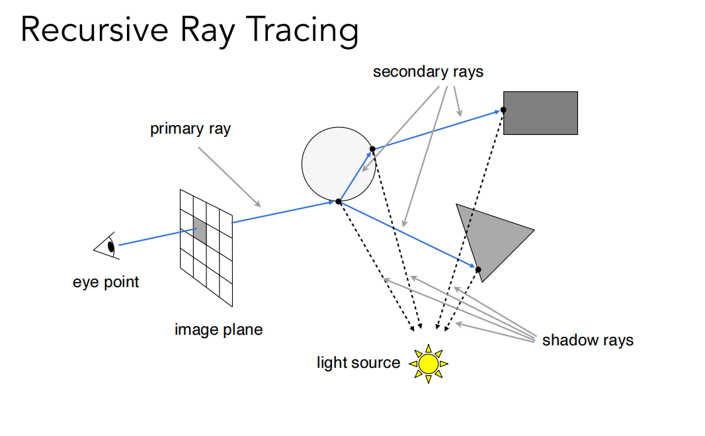
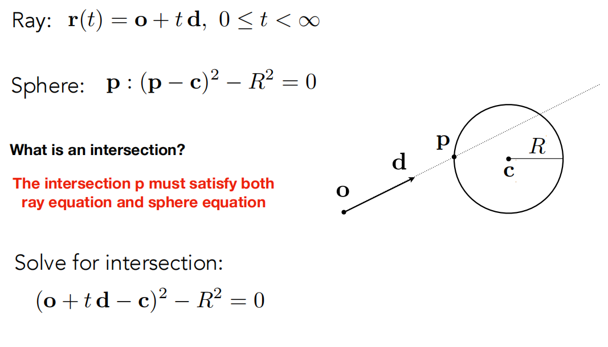
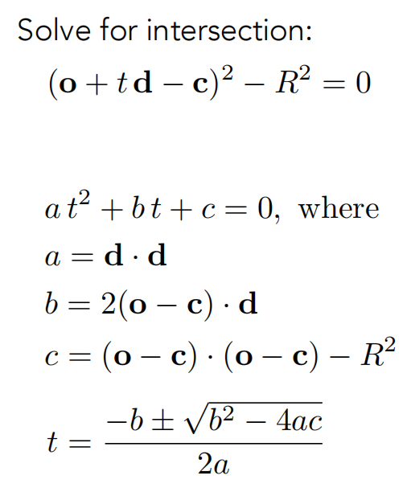
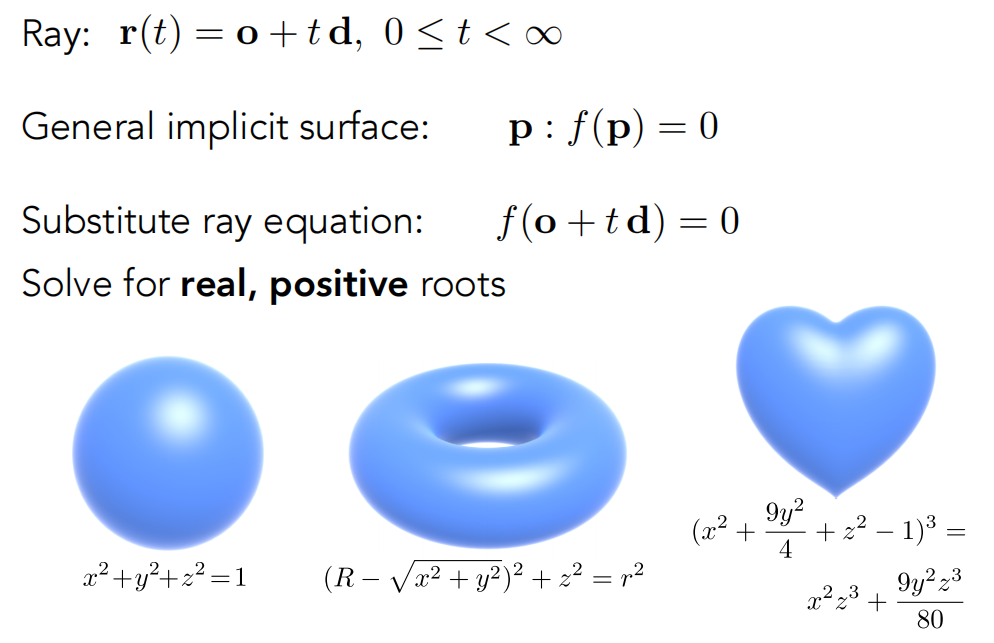
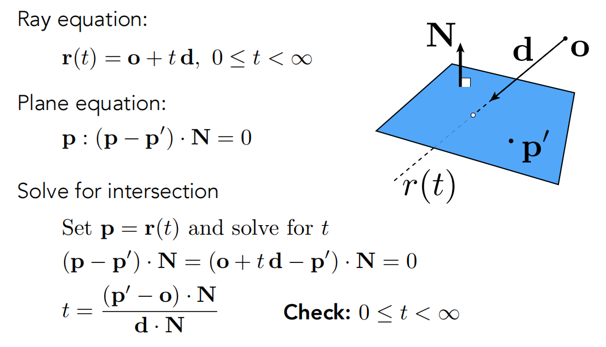
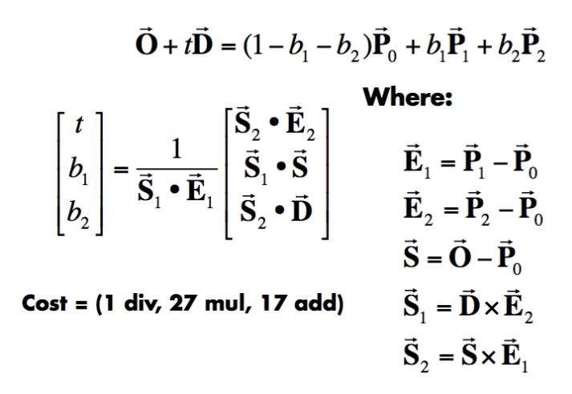
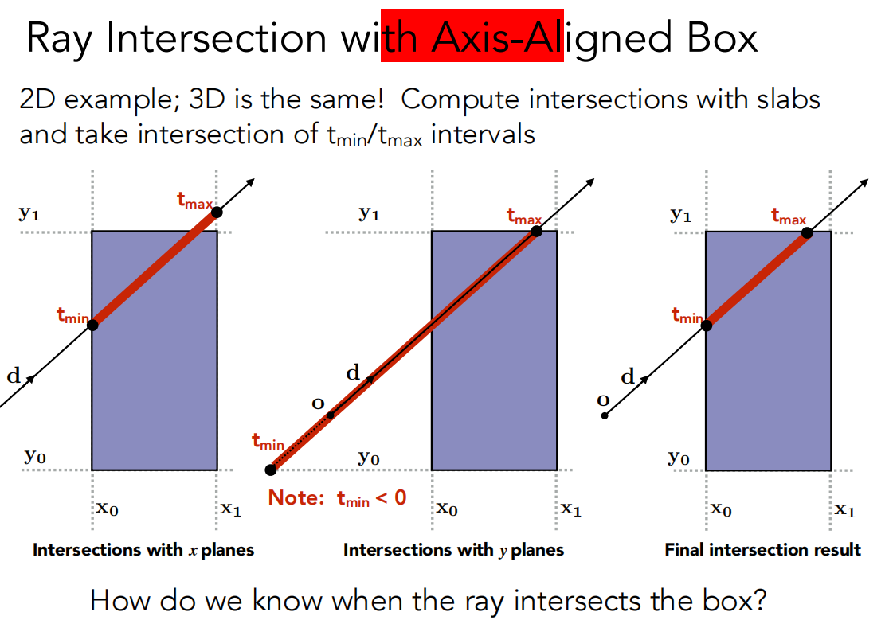
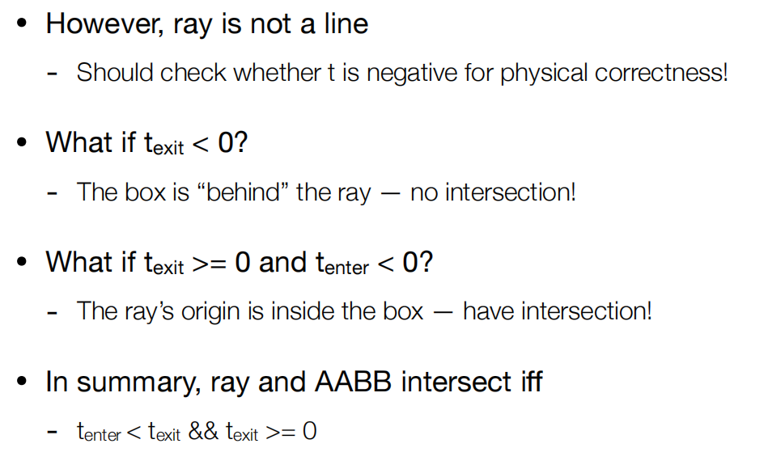

## Basic Ray-Tracing Algorithm(光线追踪基本算法)

###  关于光线的三个假定

- 光沿直线传播
-  两条光线相交后不会发生碰撞，仍然保持各自的运动方向
- 光线从光源入射到眼睛里

### 物理基础

根据光路可逆，我们可以将从光源射入眼睛的光线路径改为从眼睛发射出光线，到达环境中，实现光线追踪。

### Recursive (Whitted-Style) Ray Tracing算法流程

1.**生成主光线 (Primary Rays)**：为图像中的每个像素生成一条从摄像机（眼点）出发，穿过该像素的“视线”（Eye Ray）。

2.**求交测试 (Intersection)**：计算这条光线与场景中所有物体的交点，并找出**距离最近**的交点。

3.**局部着色 (Local Shading)**：在最近的交点处，使用局部光照模型（如Blinn-Phong）计算该点的颜色。这需要知道该点是否被光源照亮。

4.**阴影测试 (Shadow Rays)**：为了判断交点是否在阴影中，从交点向光源发射一条“阴影光线”（Shadow Ray）。如果这条光线在到达光源前与任何物体相交，则该点处于阴影中。

5.递归追踪 (Recursive Tracing)：除了主光线和阴影光线，还会生成二次光线 (Secondary Rays)

- **反射光线 (Reflected Ray)**：用于模拟镜面反射。
- **折射光线 (Refracted Ray)**：用于模拟透明物体的透射（如玻璃）。 这些二次光线会以同样的方式（求交、着色、阴影、递归）继续追踪下去，直到达到预设的递归深度或光线能量过低。

## Ray-Surface Intersection(光线-物体求交)

光线与物体求交点是光线追踪性能的关键瓶颈。

### 光线定义

光线就是一条射线，可以用向量来描述方向和长度。
$$
\mathbf{r}(t) = \mathbf{o} + t\mathbf{d} \quad 0 \leq t < \infty
$$

### 光线与球体求交点

### 光线与隐式平面相交

### 与三角形网格相交

两个步骤：

#### 1.先判断与三角形所在平面交点

#### 2.判断交点是否在三角形内

利用三个点中的两个顶点计算向量点乘正负性即可判断是否在三角形内

#### 另一种快速的计算交点方法（Möller Trumbore Algorithm）

$1-b_1-b_2+b_1+b_2=1$即系数为1，表示在一个平面内,求解x,y,z三个方向上的方程组，用线性代数知识解决。

### 包围盒（Bounding Volumes）

这是一种加速计算交点的方法，用一个长方体来全部包括物体，我们通常使用的是轴对齐包围盒（Axis-Aligned Bounding Box）。如果光线与该包围盒无交点，则肯定与该物体没有交点，有交点的话再根据上面几种方法来计算交点。

每一次只计算一对面，共三个面，求得到达面包围盒的时间$t_{min}$和离开包围盒的时间$t_{max}$ 。最终取得光线进入包围盒的时间为$t_{enter}=max\{t_{min}\}$，离开包围盒的时间为$t_{exit}=max\{t_{max}\}$

几种时间情况：

当且仅当进入时间小于离开时间并且离开时间≥0！

## 性能开销

朴素的光线追踪算法（每个像素的每条光线都与场景中所有物体求交）计算量巨大，复杂度为 `O(像素数 × 物体数 × 反射次数)`。

而使用**包围体 (Bounding Volumes)**，如AABB。先与包围体求交，只有当光线与包围体相交时，才需要去检查其内部的复杂物体，从而大幅减少不必要的求交计算。

