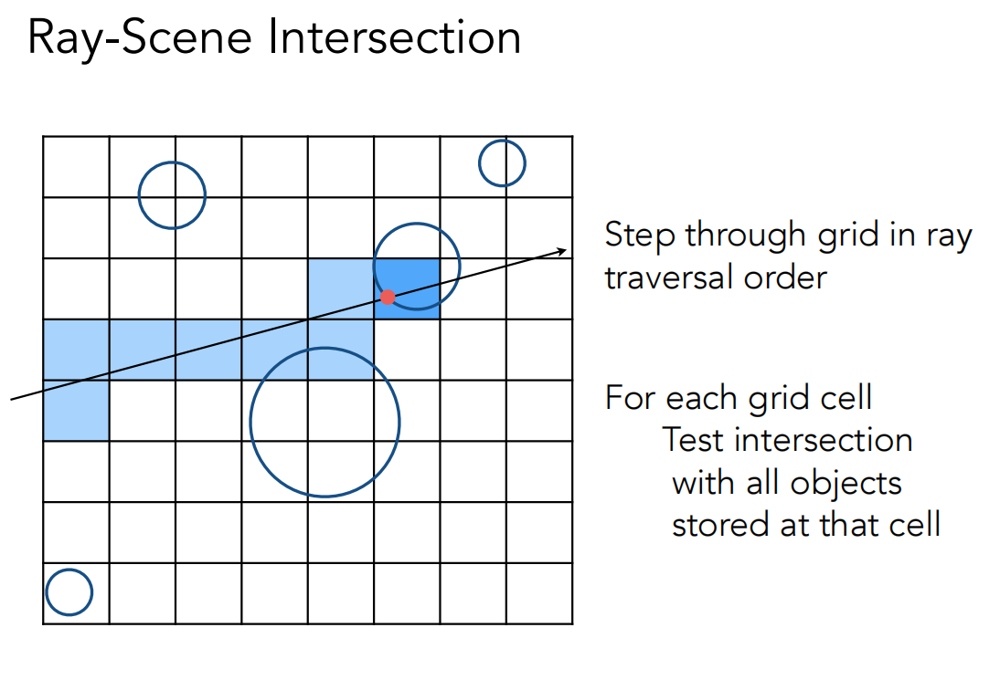
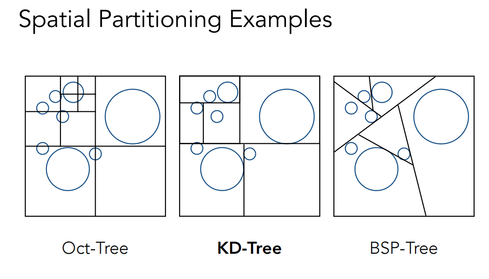
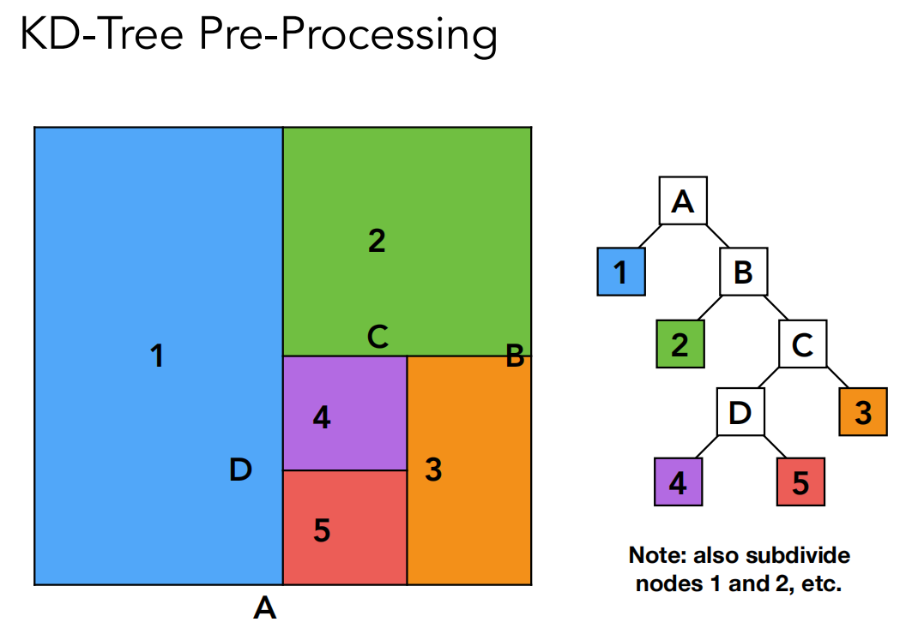
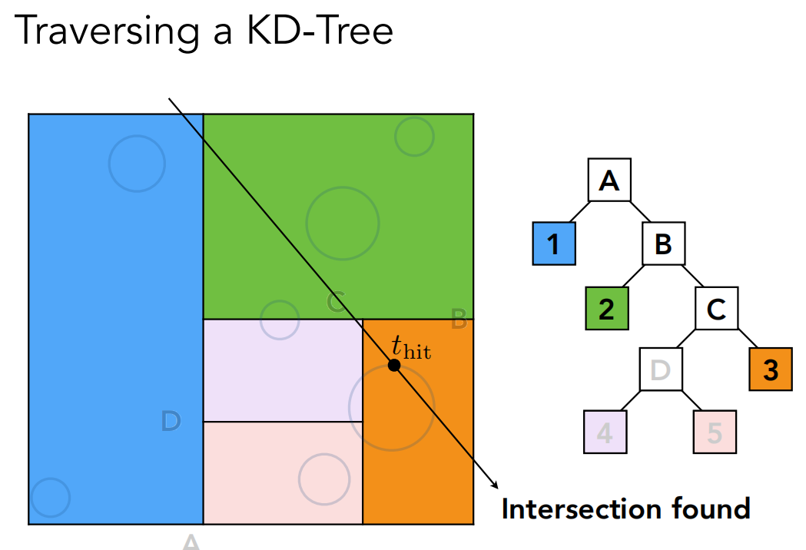
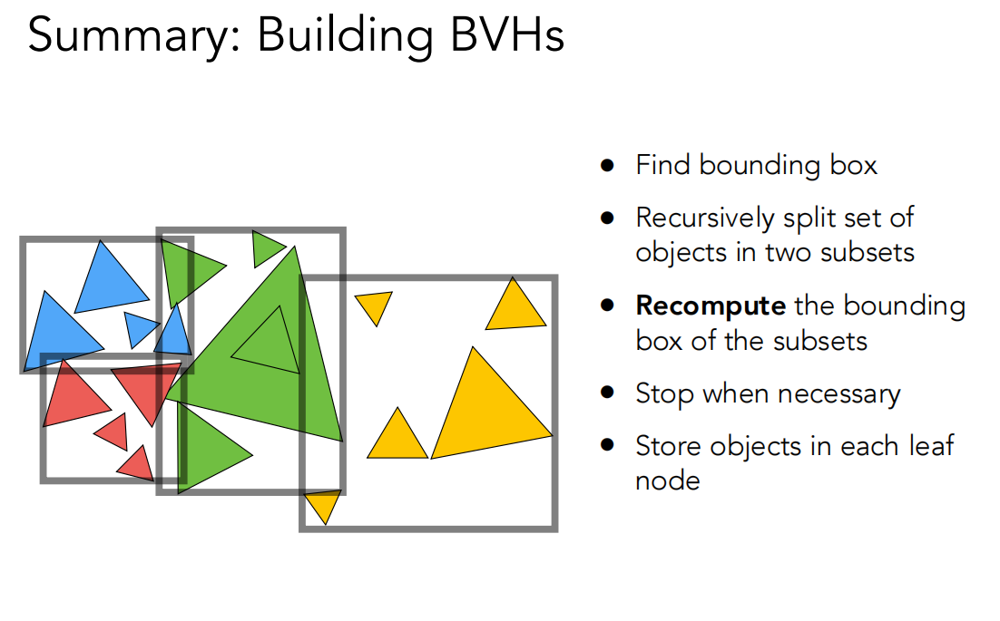
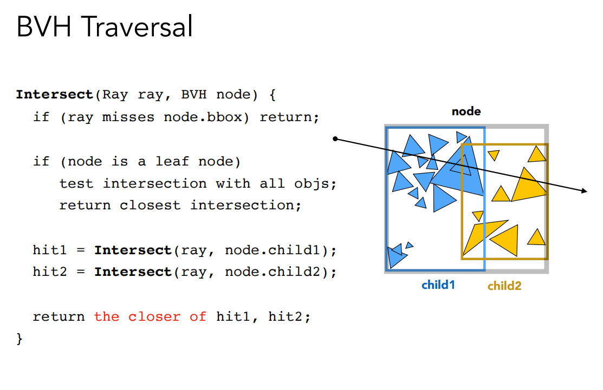
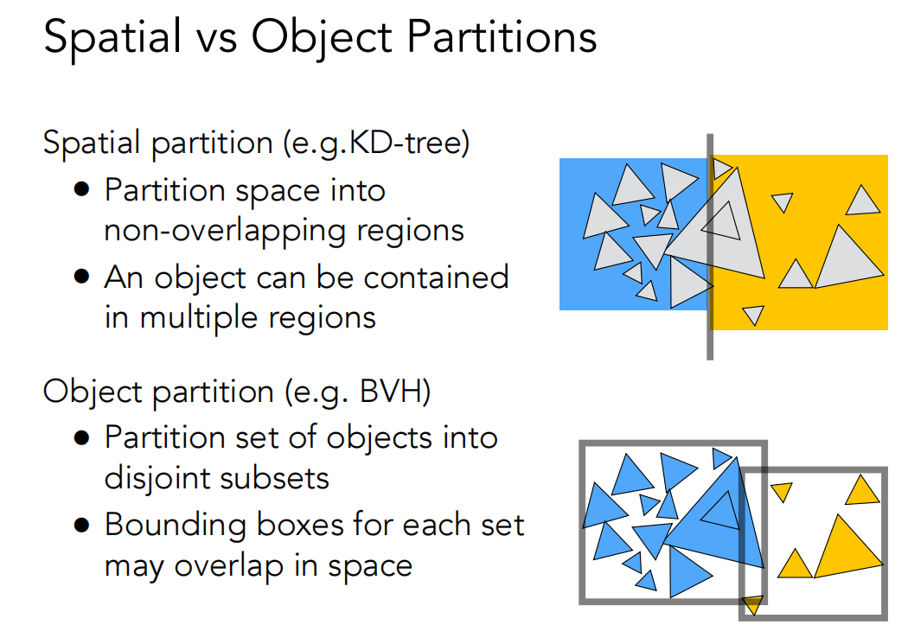
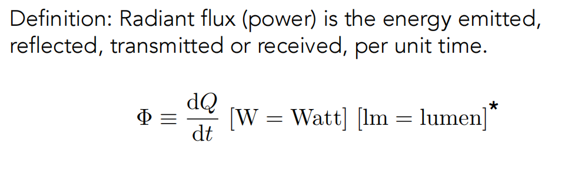
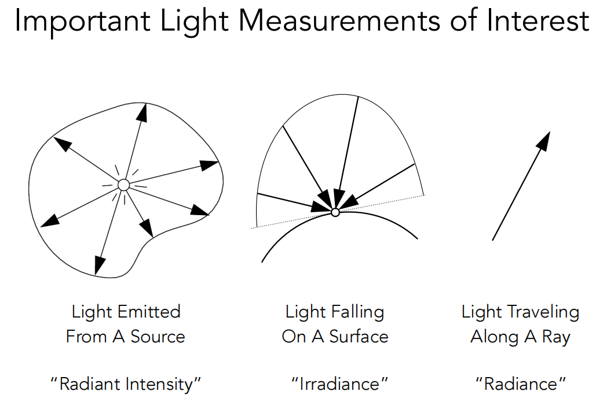
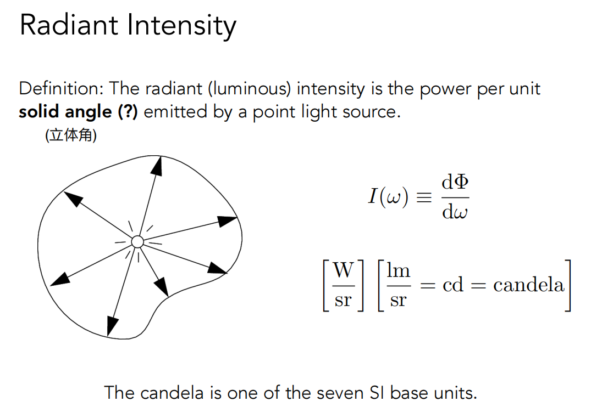

## Uniform Spatial Partitions (Grids)（统一空间网格划分）

### 预处理-建立加速网格

1.找到包围盒

2.建立网格

3.存储每个物体在哪些重叠网格当中

4.对于光线，遍历每个格子中与之相交的所有物体

### 关于网格分辨率

- 格子太少：无法加速物体相交判断
- 格子太多：需要判断许多无关格子，减慢速度
- 最佳格子数量：C*物体数量，其中C=27 in 3D

## Spatial Partitiions（空间划分）

### 三种划分方法

## KD-Tree划分过程

按照坐标轴方向进行划分，二叉树结构，叶结点存储了包含的物体，内部节点不存储物体。

遍历过程：

## Object Partitions & Bounding Volume Hierarchy (BVH)

前面的KD-Tree是对空间进行划分，而BVH是对物体进行划分。

将一系列物体划分成两类，分别求出他们的包围盒范围，以此类推，递归求解，存储物体在每个叶结点中，并且的每个物体仅存储在一个叶结点中（与KD-Tree进行对比）。

### 如何选择划分物体的依据呢？

- 选择一个维度去进行划分操作
- 依据1：每次都选择最长的维度进行划分
- 依据2：以中间物体作为划分依据

### BVHs的数据结构

内部节点：

- 包围盒
- 子节点

叶子节点：

- 包围盒
- 物体列表

BVH遍历伪代码如下：

## 空间划分和物体划分的对比

主要区别在于空间是否重叠以及一个物体是否唯一包含在一个节点内。

## Radiometry(辐射度量学)

Radiant Flux（辐射通量）：

几种度量光的概念：

光照强度：整个球体的立体角为4pi

