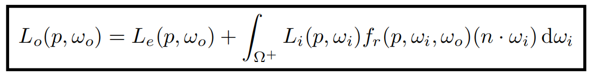

## 辐射度量学（Radiometry）

### 概念回顾

 辐射能量；辐射通量；辐射强度；立体角

### 微分立体角

### Irradiance

Irradiance是指单位面积上入射到表面点的功率。

### Lambert’s Cosine Law

通常情况，单位面积上的能量正比于余弦值。

### Radiance

Radiance是描述环境中光分布的基本场量。渲染就是在计算radiance。

定义：单位立体角内、单位投影面积上表面所发射、反射、透射或接收的功率。

可以理解为单位立体角上的irradiance，也可以理解为单位投影面积上的intensity。

Irradiance是单位面积上所有方向的光，而radiance是某个立体角上的光。

#### Incident Radiance 入射

是指单位立体角上到达表面上的irradiance。

#### Exiting Radiance 出射

是指单位投影面积上的intensity，与上面incident radiance的形式是等价的，只是两种理解radiance的视角。

### Irradiance vs. Radiance

Irradiance:面积dA上接收到的所有能量；

Radiance:面积dA从方向dω来接收到的能量。

将所有方向的Radiance累加起来就是Irradiance。

## Bidirectional Reflectance Distribution Function (BRDF) 双向反射分布函数

微分式将入射和出射radiance联系在一起。

### 反射方程

某个出射角的出射radiance等于将所有入射角的radiance累加起来的值。

但是注意到解出反射后的radiance需要入射radiance，而同时入射radiance也有可能是另外一个物体的反射的radiance，形成递归方程。

**加上光源直接发射项可以得到完整的渲染方程：**

注意：一般只考虑半球，而不考虑下半球贡献的光。

光线弹射一次称为直接光照，两次及以上为间接光照，全局光照为**直接光照+间接光照**。

