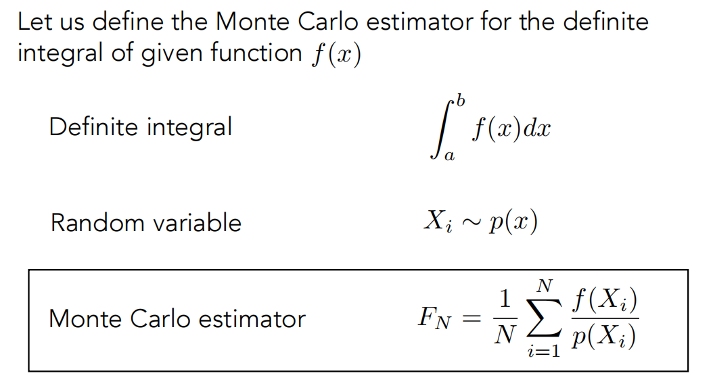
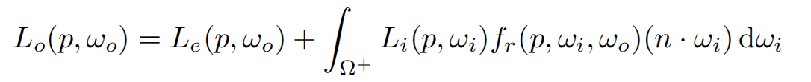
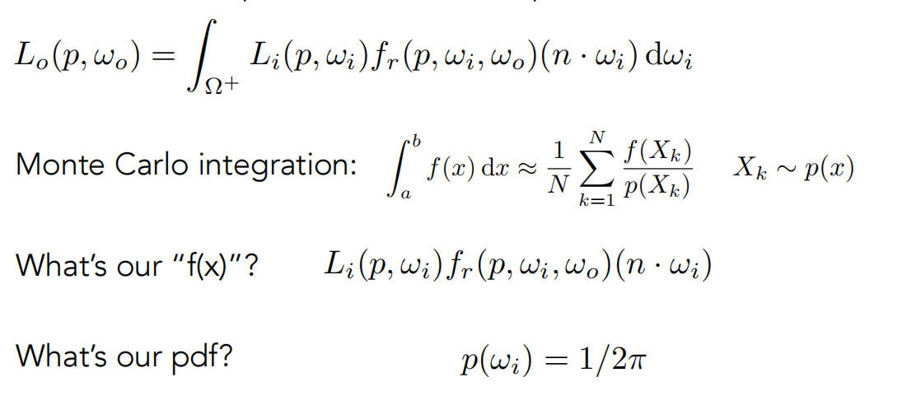
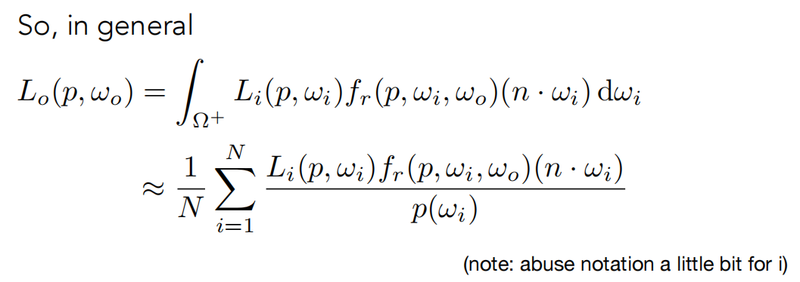
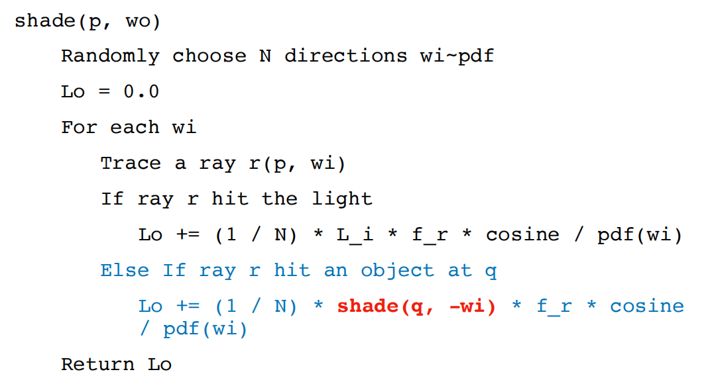
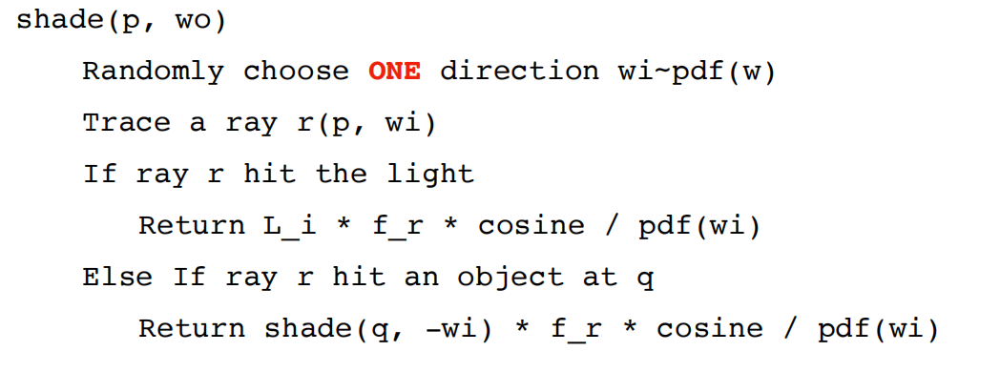
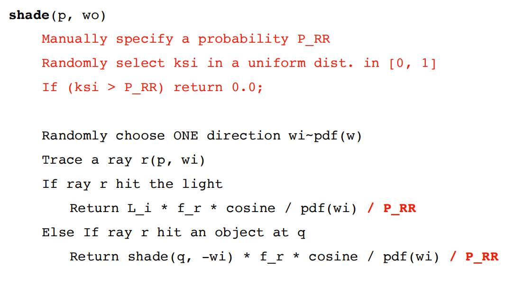
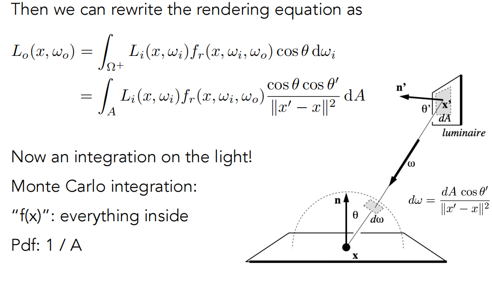
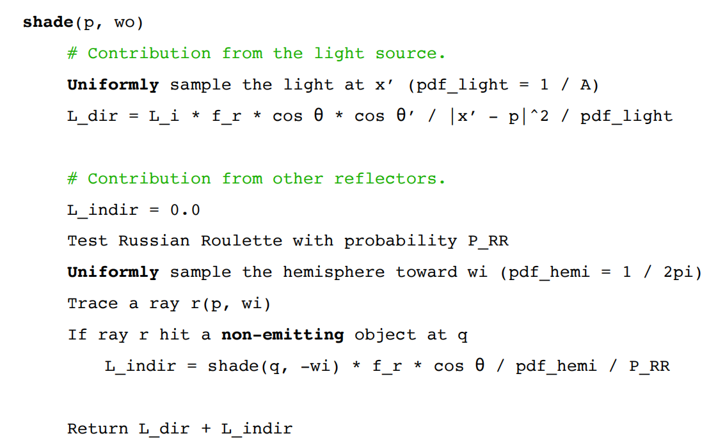
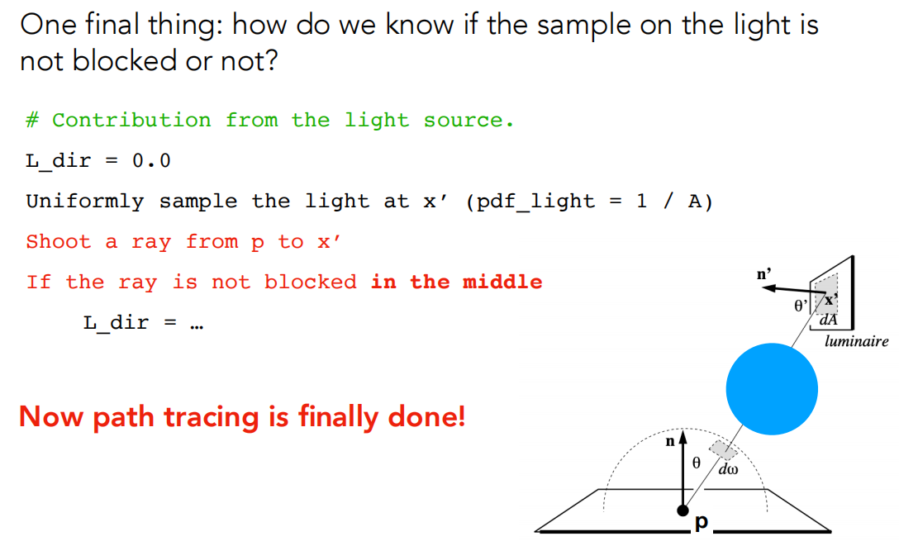

## Monte Carlo Integration（蒙特卡洛积分）

对于一个难以用解析法积分的函数，可以使用蒙特卡洛积分法。通过随机取函数值的平均来估计整个函数的积分值。

其中p(x)为概率密度函数，n取的数量越多，结果方差越小，图像越平滑。

## Path Tracing（路径追踪）

Whitted-Style光线追踪是错误的，但是渲染方程是正确的。

如何求解这个积分？使用蒙特卡洛积分！

### 第一步：直接光照的蒙特卡洛积分法

注意只计算半球，将整个函数当成f(x)!

### 第二步：引入全局光照

如果击中的是另一个物体q，则应该递归调用shade(q,-wi)。

### 第三步：解决光线爆炸问题（路径追踪诞生）

如果每个着色点都发送N条光线，经过几轮递归后，光线数量会呈指数级增长，计算成本无法承受。注意到只有当 `N=1` 时，光线数量才不会爆炸。

**路径追踪（Path Tracing）：** 在每个着色点只随机采样**一个**方向，发射**一条**光线。通过在每个像素内追踪多条独立的“路径”（Path）并平均它们的辐射度来获得最终像素颜色。

但是这样会无限递归弹射下去，光线无法停止，如何解决问题？

### 第四步：解决无限递归问题（俄罗斯轮盘赌）

俄罗斯轮盘赌（Russian Roulette, RR）：

 设定一个存活概率 P(0 < P < 1)。

- 以概率 `P` 继续追踪光线，并将结果除以 `P`。

- 以概率 `1-P` 停止追踪，返回0。

**最终的数学期望不变：** `E = P * (Lo / P) + (1-P) * 0 = Lo`。

在半球上均匀采样时，击中光源的概率可能很低，大部分计算被“浪费”在没有击中光源的光线上,如何加快运算？

### **第五步：提高效率（光源采样）**

**光源采样**：直接在光源表面进行采样，确保每条采样光线都“有用”。

需要将渲染方程从对立体角 `dω` 的积分，转换为对光源面积 `dA` 的积分。转换关系为：`dω = (cosθ' / ||x'-x||²) dA`，其中 `θ'` 是光源表面法线与光线的夹角。

### 最终算法

在 shade函数中，将光照分为两部分计算：

1. **直接光照：** 直接在光源上采样，计算贡献（无需RR）。
2. **间接光照：** 在半球上采样，递归调用 `shade`（需要RR）。

**阴影判断：** 对于光源采样得到的点，需要发射一条“阴影光线”来判断它是否被其他物体遮挡。

