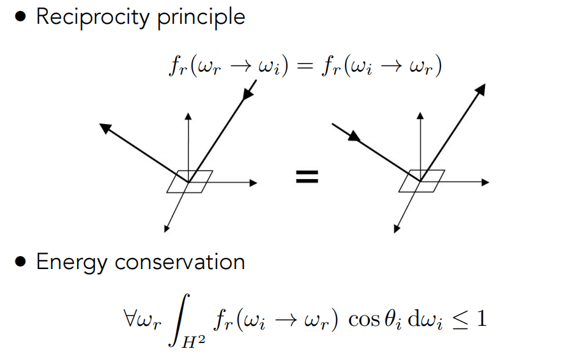

## Material==BRDF

BRDF决定了光如何被反射，即反射光的形式。

### 漫反射材质

光线会被反射到各个方向上去。

假设光线均匀射入，即$L_i$是一个常数，推导出射光如下图所示。

此时brdf的值为1/pi,albedo的取值为0~1。

### Glossy material

### Ideal reflective / refractive material (BSDF)

BSDF(散射)=BRDF（反射）+BTDF（折射）

### Perfect Specular Reflection

从上往下看，入射和出射的方位角相反。

### 斯涅尔法则（即折射定律）

### Fresnel Reflection / Term(菲涅尔项)

如下图所示，以不同的角度观察有不同程度的反射效果。反射率（reflectance）取决于入射角（以及光的偏振状态）；在这个例子中，反射率随着入射角趋近于掠射角（grazing angle）而增加。当入射角度为0时，反射率最小，当入射角度接近90度时，反射率接近于1。

菲涅尔公式如下所示：

反射率R**对s 偏振光**（垂直偏振）和**p 偏振光**（平行偏振）有不同的响应，方便计算取下方的近似公式计算！

## Microfacet Material（微表面材质）

从远处看一个表面，看到是材质和外观，而从近处看，能看到表面上具体的几何。每一个微表面都有它自己的法向量。

当法向量的分布比较集中时，就是glossy，而比较分散时，就是diffuse。

### Microfacet BRDF

每一个微表面我们都把它当成镜面。

第一项是菲涅尔项，从不同的角度入射有不同的反射率；第二项是shadowing-masking项，表示表面其他部分对它的几何遮挡程度；第三项是法向量的分布，**D(h)** 表示：在某个方向 **h** 上，有多少微表面的法线指向该方向，只有法线与半角向量 **h** 对齐的微表面才会将入射光反射到出射方向

### Isotropic / Anisotropic Materials (BRDFs)（各向同性/各向异性）

- 各向同性：brdf与绝对方位角关系很小，只与相对方位角有关，从4维降到了3维。

- 各向异性：brdf与绝对方位角也有关系，需要用四个量来描述。

### BRDF的性质

非负性；线性；光路可逆性；能量守恒