## Barycentric coordinates（重心坐标）

为什么插值？

- 指定顶点上的值
- 获得三角形内平滑变化的值

可以插值什么内容？

- Texture coordinates（纹理坐标）, colors（颜色）, normal vectors（法线），...

### 重心坐标公式

$$(x,y)=αA+βB+γC$$

$α+β+γ=1且α>=0,β>=0,γ>=0$

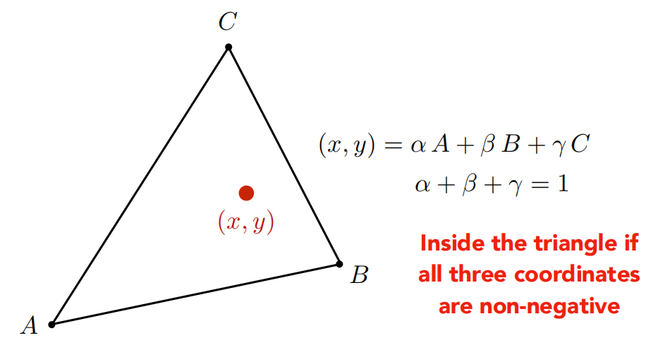

由$(x,y)$可求得$α，β，γ$：

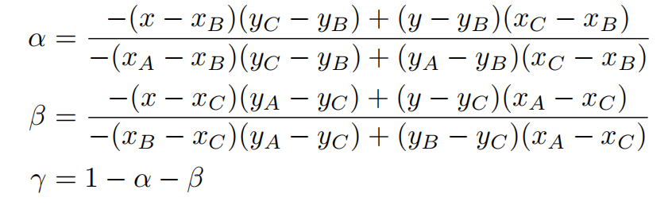

注意：**重心坐标在投影下是会变化的**。

## Applying Textures（应用纹理）

我们要将纹理应用到物体上。(x,y)是像素坐标，(u,v)是纹理坐标。

纹理应用步骤：

对于每一个光栅化的屏幕像素：
	(u,v) = 计算(x,y)处对应的纹理坐标  *(x,y)是使用的重心坐标*

​	texcolor(纹理颜色) = texture.sample(u,v);  *纹理上取样纹理坐标(u,v)处的颜色*

​	将样本颜色设置为texcolor; *通常会使用Blinn-Phong reflectance model*

## Texture Magnification 纹理放大

### Easy Case（纹理太小）

这意味着多个个像素需要对应同一个**texel**（纹理元素，纹素，即在纹理上的一个像素）

我们可以使用**Bilinear Interpolation**（双线性插值，考虑周围2x2邻域）和**Bicubic Interpolation**（双三次插值，考虑周围4x4邻域）来解决这个问题。

下面介绍的是Bilinear Interpolation（双线性插值法）：

如何取样纹理上(u,v)处的值f(x,y)?

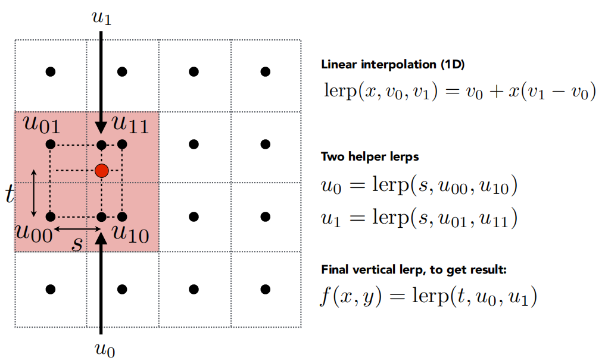

先进行水平插值，求出$u_1$和$u_0$，再进行垂直插值求出$f(x,y)$

处理效果：

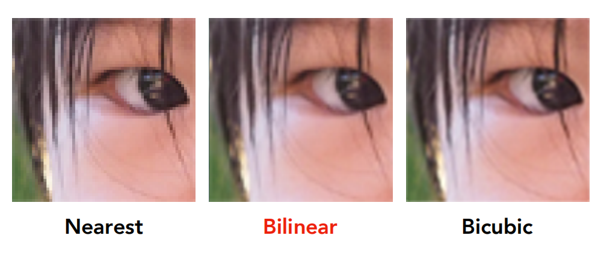

### Hard case(纹理太大)

如果我们还是使用点插值，将会出现**多个纹理元素只对应一个像素的问题，即采样率过低**，这种现象被称为**Texel Footprint**。

在图像上，便体现为出现**Moire**（摩尔纹）和**Jaggies**（锯齿）。

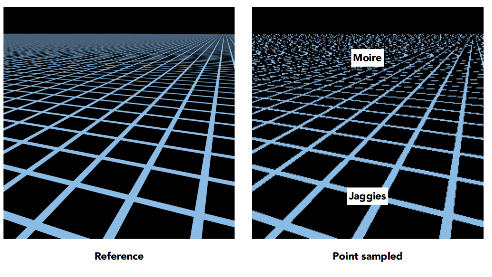

**Super sampling**（超采样）将会解决问题，但是太过于耗费计算资源，如何解决？**可以在不同的位置采取不同的采样率！**

## Mipmap

可以允许快速查询某个范围的近似值，但是注意只能**方形**!

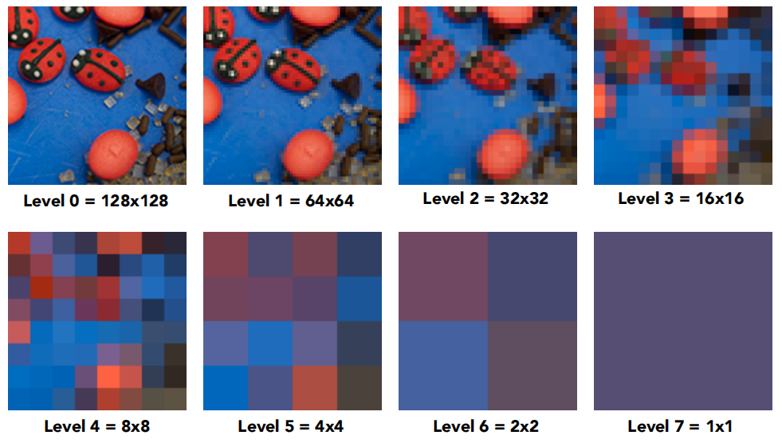

每次都将$2*2$的像素合成为1个新像素，例如图中$128*128$的图像共有8层。

### Compluting Mipmap Level D(计算层级)

使用相邻的屏幕纹理来计算**Texture Footprint**。

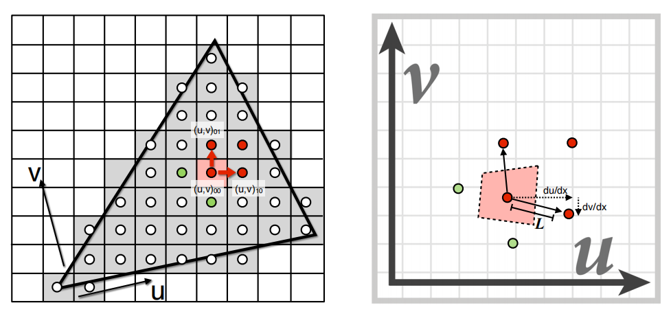

$D=log_2L$           $L=max(\sqrt{(\frac{du}{dx})^2+(\frac{dv}{dx})^2},\sqrt{(\frac{du}{dy})^2+(\frac{dv}{dy})^2})$

- $\sqrt{(\frac{du}{dx})^2+(\frac{dv}{dx})^2}$：表示沿屏幕 x方向（水平）纹理的拉伸程度。
- $\sqrt{(\frac{du}{dy})^2+(\frac{dv}{dy})^2}$：表示沿屏幕 y 方向（垂直）纹理的拉伸程度。
- L：取两者的最大值，即纹理在像素空间中的最大拉伸比例。

- $D=log_2L$ ：将拉伸比例 L转换为对数尺度，对应Mipmap的层级。
  - 若 L=1（纹理与像素1:1映射），则 D=0，使用原始纹理（Level 0）。
  - 若 L=4（纹理被拉伸4倍），则 D=2，选择Level 2的Mipmap（缩小4倍的纹理）。
  - 若 L<1（纹理被压缩），可能启用各向异性过滤或更高分辨率层级。

mipmap计算层级效果如下图，不同距离采样率不同：

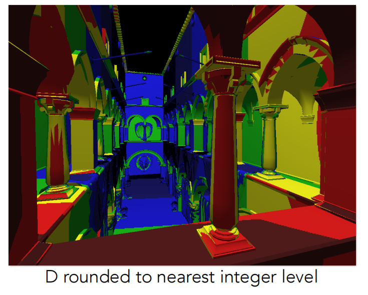
但我们会发现边界处**无渐变处理**，可以使用**基于D值的线性插值**使Mipmap Level变化平滑。

效果如图：

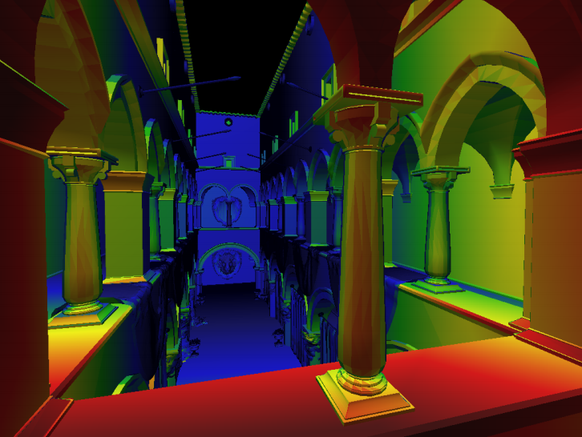

### Anisotropic Filtering（各向异性过滤）

如果Pixel Footerprint不是方形而是**不规则图形**，那么mipmap的效果不太好，需要使用各项异性过滤解决。

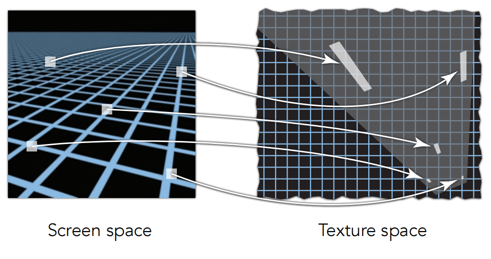

Mipmap得到的一系列的纹理图其实就是对角线上的卫星，可以看到都是正方形的，而各向异性过滤会对把原纹理图缩放成不同大小的矩形，各向异性生成的一系列纹理图也叫**Ripmaps**。

每一行是对纹理图做宽度压缩，每一列是对纹理图做高度压缩。

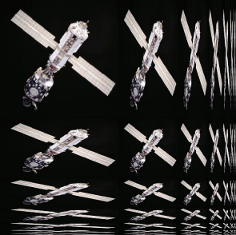

但非常不规则的图形仍然无法用各向异性过滤来解决，需要使用**EWA Filtering**方法。

使用椭圆形去近似不规则图形，然后多次查询得到加权平均值，但耗时长。

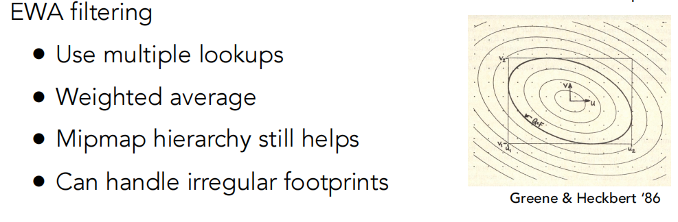

