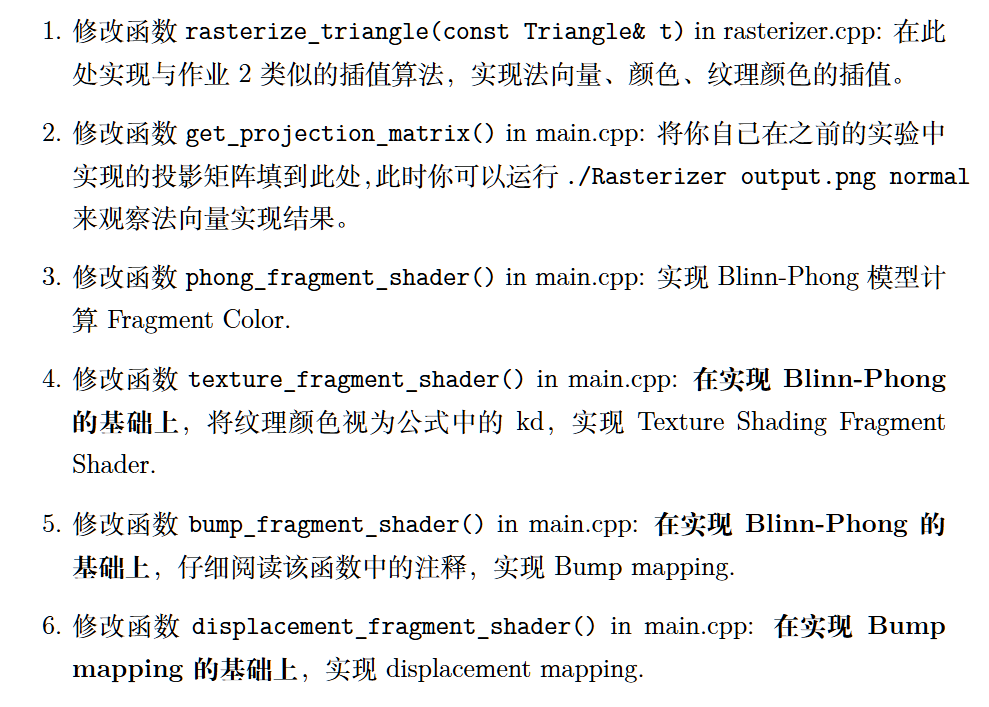
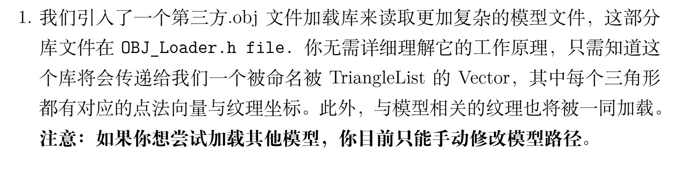
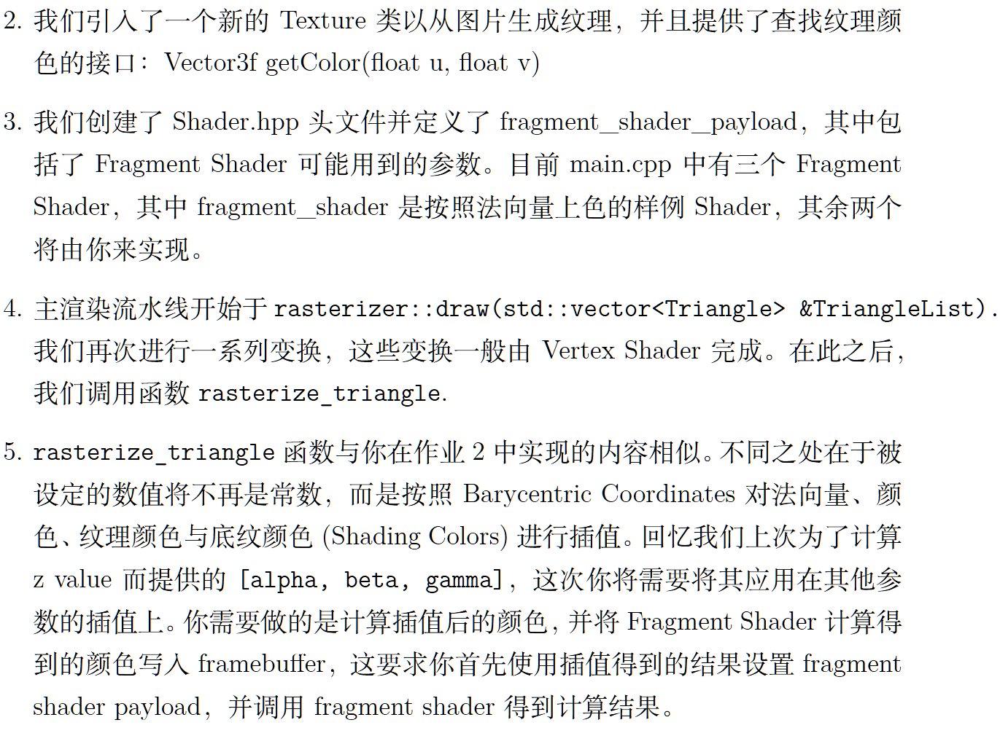
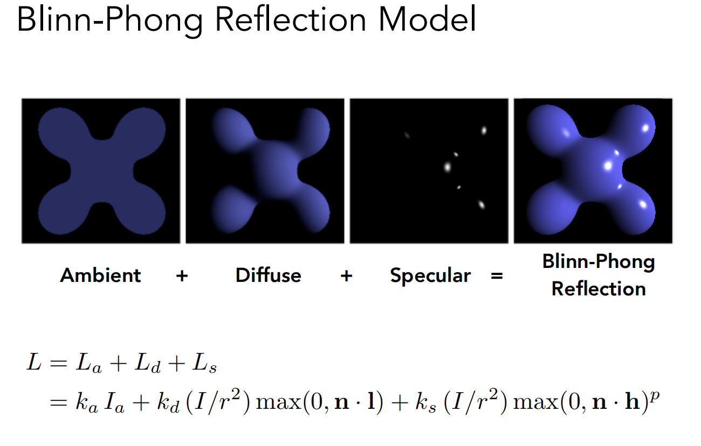
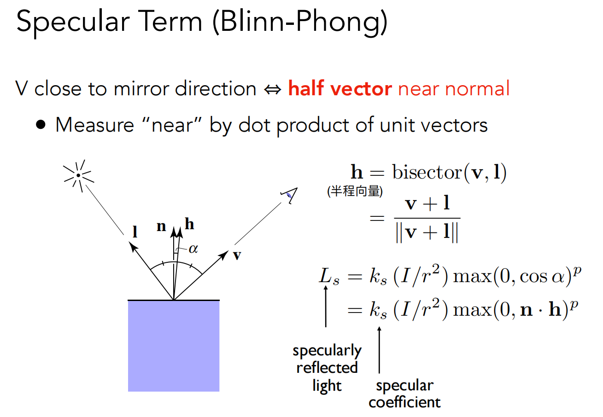

## 一.作业要求







## 二、插值算法

```c++
void rst::rasterizer::rasterize_triangle(const Triangle& t, const std::array<Eigen::Vector3f, 3>& view_pos) 
{
    // TODO: From your HW3, get the triangle rasterization code.
    // TODO: Inside your rasterization loop:
    //    * v[i].w() is the vertex view space depth value z.
    //    * Z is interpolated view space depth for the current pixel
    //    * zp is depth between zNear and zFar, used for z-buffer

    // float Z = 1.0 / (alpha / v[0].w() + beta / v[1].w() + gamma / v[2].w());
    // float zp = alpha * v[0].z() / v[0].w() + beta * v[1].z() / v[1].w() + gamma * v[2].z() / v[2].w();
    // zp *= Z;

    // TODO: Interpolate the attributes:
    // auto interpolated_color
    // auto interpolated_normal
    // auto interpolated_texcoords
    // auto interpolated_shadingcoords

    // Use: fragment_shader_payload payload( interpolated_color, interpolated_normal.normalized(), interpolated_texcoords, texture ? &*texture : nullptr);
    // Use: payload.view_pos = interpolated_shadingcoords;
    // Use: Instead of passing the triangle's color directly to the frame buffer, pass the color to the shaders first to get the final color;
    // Use: auto pixel_color = fragment_shader(payload);
    
    int min_x = INT_MAX,min_y = INT_MAX,max_x = 0,max_y = 0;
    min_x = std::min({t.v[0].x(),t.v[1].x(),t.v[2].x()});
    max_x = std::max({t.v[0].x(),t.v[1].x(),t.v[2].x()});
    min_y = std::min({t.v[0].y(),t.v[1].y(),t.v[2].y()});
    max_y = std::max({t.v[0].y(),t.v[1].y(),t.v[2].y()});

    for(int x = min_x;x<=max_x;x++){
        for(int y = min_y;y<=max_y;y++){
            if(!insideTriangle(x,y,&t.v[0])) continue;
            auto [alpha,beta,gamma] = computeBarycentric2D(x,y,&t.v[0]);
            float Z = 1.0 / (alpha / t.v[0].w() + beta / t.v[1].w() + gamma / t.v[2].w());
            float zp = alpha * t.v[0].z() / t.v[0].w() + beta * t.v[1].z() / t.v[1].w() + gamma * t.v[2].z() / t.v[2].w();
            zp *= Z;

            if(depth_buf[get_index(x,y)] == std::numeric_limits<float>::infinity() || 
                zp > depth_buf[get_index(x,y)]){
                depth_buf[get_index(x,y)] = zp;
               
                auto interpolated_color = interpolate(alpha, beta, gamma, Eigen::Vector3f(t.color[0]/t.v[0].w()), Eigen::Vector3f(t.color[1] / t.v[1].w()) , Eigen::Vector3f(t.color[2] / t.v[2].w()) , 1/Z);

                auto interpolated_normal = interpolate(alpha,beta,gamma,Eigen::Vector3f(t.normal[0] / t.v[0].w()) ,Eigen::Vector3f(t.normal[1] / t.v[1].w()),Eigen::Vector3f(t.normal[2] / t.v[2].w()),1/Z);

                auto interpolated_texcoords = interpolate(alpha,beta,gamma,Eigen::Vector2f(t.tex_coords[0] / t.v[0].w()) ,Eigen::Vector2f(t.tex_coords[1] / t.v[1].w()) ,Eigen::Vector2f(t.tex_coords[2] / t.v[2].w()),1/Z);
                
                auto interpolated_shadingcolors = interpolate(alpha,beta,gamma,Eigen::Vector3f(view_pos[0]/t.v[0].w()),Eigen::Vector3f(view_pos[1]/t.v[1].w()),Eigen::Vector3f(view_pos[2]/t.v[2].w()),1/Z);

                fragment_shader_payload payload(interpolated_color, interpolated_normal.normalized(), interpolated_texcoords, texture ? &*texture : nullptr);
                payload.view_pos = interpolated_shadingcolors;
                auto pixel_color = fragment_shader(payload);
                Eigen::Vector2i point(x,y);
                set_pixel(point,pixel_color);
            }
        }
    }    
}
```

与作业二类似，首先是求出包围盒的范围。然后枚举每一个像素，先判断是否在三角形内，然后再使用z-buffer算法，如果当前点更加靠前则更新depth_buf。接下来依次对颜色，法向量、纹理坐标、纹理底色进行插值，**特别注意纹理底色要用视图空间当中的坐标进行插值！**

## 三、Blinn-Phong模型





根据Blinn-Phong着色模型，光照由环境光、漫反射光和高光三部分组成。代入公式进行计算即可。

```c++
Eigen::Vector3f phong_fragment_shader(const fragment_shader_payload& payload)
{
    Eigen::Vector3f ka = Eigen::Vector3f(0.005, 0.005, 0.005);
    Eigen::Vector3f kd = payload.color;
    Eigen::Vector3f ks = Eigen::Vector3f(0.7937, 0.7937, 0.7937);

    auto l1 = light{{20, 20, 20}, {500, 500, 500}};
    auto l2 = light{{-20, 20, 0}, {500, 500, 500}};

    std::vector<light> lights = {l1, l2};
    Eigen::Vector3f amb_light_intensity{10, 10, 10};
    Eigen::Vector3f eye_pos{0, 0, 10};

    float p = 150;

    Eigen::Vector3f color = payload.color;
    Eigen::Vector3f point = payload.view_pos;
    Eigen::Vector3f normal = payload.normal;

    Eigen::Vector3f result_color = {0, 0, 0};
    for (auto& light : lights)
    {
        // TODO: For each light source in the code, calculate what the *ambient*, *diffuse*, and *specular* 
        // components are. Then, accumulate that result on the *result_color* object.
        auto v = eye_pos - point;
        auto l = light.position - point;
        auto h = (l+v).normalized();
        auto r2 = l.dot(l);

        auto La = ka.cwiseProduct(amb_light_intensity);
        auto Lb = kd.cwiseProduct(light.intensity/r2)*std::max(0.0f,normal.normalized().dot(l.normalized()));
        auto Ls = ks.cwiseProduct(light.intensity/r2)*std::pow(std::max(0.0f,normal.normalized().dot(h)),p);
        result_color += La+Lb+Ls;
    }

    return result_color * 255.f;
}
```

特别注意点乘的两个向量要进行归一化操作！

## 四、纹理着色模型

与Bling-Phong模型相似，只需要在纹理图像上u，v取值得到点的颜色即可。

```c++
Eigen::Vector3f texture_fragment_shader(const fragment_shader_payload& payload)
{
    Eigen::Vector3f return_color = {0, 0, 0};
    if (payload.texture)
    {
        // TODO: Get the texture value at the texture coordinates of the current fragment
        return_color = payload.texture->getColor(payload.tex_coords[0],payload.tex_coords[1]);
    }
    Eigen::Vector3f texture_color;
    texture_color << return_color.x(), return_color.y(), return_color.z();

    Eigen::Vector3f ka = Eigen::Vector3f(0.005, 0.005, 0.005);
    Eigen::Vector3f kd = texture_color / 255.f;
    Eigen::Vector3f ks = Eigen::Vector3f(0.7937, 0.7937, 0.7937);

    auto l1 = light{{20, 20, 20}, {500, 500, 500}};
    auto l2 = light{{-20, 20, 0}, {500, 500, 500}};

    std::vector<light> lights = {l1, l2};
    Eigen::Vector3f amb_light_intensity{10, 10, 10};
    Eigen::Vector3f eye_pos{0, 0, 10};

    float p = 150;

    Eigen::Vector3f color = texture_color;
    Eigen::Vector3f point = payload.view_pos;
    Eigen::Vector3f normal = payload.normal;

    Eigen::Vector3f result_color = {0, 0, 0};

    for (auto& light : lights)
    {
        // TODO: For each light source in the code, calculate what the *ambient*, *diffuse*, and *specular* 
        // components are. Then, accumulate that result on the *result_color* object.
        auto v = eye_pos - point;
        auto l = light.position - point;
        auto h = (l+v).normalized();
        auto r2 = l.dot(l);

        auto La = ka.cwiseProduct(amb_light_intensity);
        auto Lb = kd.cwiseProduct(light.intensity/r2)*std::max(0.0f,normal.normalized().dot(l.normalized()));
        auto Ls = ks.cwiseProduct(light.intensity/r2)*std::pow(std::max(0.0f,normal.normalized().dot(h)),p);
        result_color += La+Lb+Ls;
    }

    return result_color * 255.f;
}
```

## 五、Bump着色模型

```c++
Eigen::Vector3f bump_fragment_shader(const fragment_shader_payload& payload)
{
    
    Eigen::Vector3f ka = Eigen::Vector3f(0.005, 0.005, 0.005);
    Eigen::Vector3f kd = payload.color;
    Eigen::Vector3f ks = Eigen::Vector3f(0.7937, 0.7937, 0.7937);

    auto l1 = light{{20, 20, 20}, {500, 500, 500}};
    auto l2 = light{{-20, 20, 0}, {500, 500, 500}};

    std::vector<light> lights = {l1, l2};
    Eigen::Vector3f amb_light_intensity{10, 10, 10};
    Eigen::Vector3f eye_pos{0, 0, 10};

    float p = 150;

    Eigen::Vector3f color = payload.color; 
    Eigen::Vector3f point = payload.view_pos;
    Eigen::Vector3f normal = payload.normal;


    float kh = 0.2, kn = 0.1;

    // TODO: Implement bump mapping here
    // Let n = normal = (x, y, z)
    // Vector t = (x*y/sqrt(x*x+z*z),sqrt(x*x+z*z),z*y/sqrt(x*x+z*z))
    // Vector b = n cross product t
    // Matrix TBN = [t b n]
    // dU = kh * kn * (h(u+1/w,v)-h(u,v))
    // dV = kh * kn * (h(u,v+1/h)-h(u,v))
    // Vector ln = (-dU, -dV, 1)
    // Normal n = normalize(TBN * ln)

    auto x = normal.x();
    auto y = normal.y();
    auto z = normal.z();

    auto u = payload.tex_coords[0];
    auto v = payload.tex_coords[1];

    auto w = payload.texture->width;
    auto h = payload.texture->height;

    Vector3f t(x * y / sqrt(x*x + z*z), sqrt(x*x + z*z), z * y / sqrt(x*x + z*z));
    Vector3f b = normal.normalized().cross(t.normalized());
    Matrix3f TBN;
    TBN <<  t.x(), b.x(), normal.x(),
            t.y(), b.y(), normal.y(),
            t.z(), b.z(), normal.z();

    auto h1 = (payload.texture->getColor(u+1.0f/w,v)).norm();
    auto h2 = (payload.texture->getColor(u,v+1.0f/h)).norm();
    auto h0 = (payload.texture->getColor(u,v)).norm();

    auto dU = kh * kn * (h1 - h0);
    auto dV = kh * kn * (h2 - h0);
    Vector3f ln(-dU,-dV,1.0f);
    normal = (TBN * ln).normalized();

    Eigen::Vector3f result_color = {0, 0, 0};
    result_color = normal;

    return result_color * 255.f;
}

```

## 六、displacement贴图着色

```c++
Eigen::Vector3f displacement_fragment_shader(const fragment_shader_payload& payload)
{
    
    Eigen::Vector3f ka = Eigen::Vector3f(0.005, 0.005, 0.005);
    Eigen::Vector3f kd = payload.color;
    Eigen::Vector3f ks = Eigen::Vector3f(0.7937, 0.7937, 0.7937);

    auto l1 = light{{20, 20, 20}, {500, 500, 500}};
    auto l2 = light{{-20, 20, 0}, {500, 500, 500}};

    std::vector<light> lights = {l1, l2};
    Eigen::Vector3f amb_light_intensity{10, 10, 10};
    Eigen::Vector3f eye_pos{0, 0, 10};

    float p = 150;

    Eigen::Vector3f color = payload.color; 
    Eigen::Vector3f point = payload.view_pos;
    Eigen::Vector3f normal = payload.normal;

    float kh = 0.2, kn = 0.1;
    
    // TODO: Implement displacement mapping here
    // Let n = normal = (x, y, z)
    // Vector t = (x*y/sqrt(x*x+z*z),sqrt(x*x+z*z),z*y/sqrt(x*x+z*z))
    // Vector b = n cross product t
    // Matrix TBN = [t b n]
    // dU = kh * kn * (h(u+1/w,v)-h(u,v))
    // dV = kh * kn * (h(u,v+1/h)-h(u,v))
    // Vector ln = (-dU, -dV, 1)
    // Position p = p + kn * n * h(u,v)
    // Normal n = normalize(TBN * ln)

    auto x = normal.x();
    auto y = normal.y();
    auto z = normal.z();

    auto u = payload.tex_coords[0];
    auto v = payload.tex_coords[1];

    auto w = payload.texture->width;
    auto h = payload.texture->height;

    Vector3f t(x * y / sqrt(x*x + z*z), sqrt(x*x + z*z), z * y / sqrt(x*x + z*z));
    Vector3f b = normal.normalized().cross(t.normalized());
    Matrix3f TBN;
    TBN <<  t.x(), b.x(), normal.x(),
            t.y(), b.y(), normal.y(),
            t.z(), b.z(), normal.z();

    auto h1 = (payload.texture->getColor(u+1.0f/w,v)).norm();
    auto h2 = (payload.texture->getColor(u,v+1.0f/h)).norm();
    auto h0 = (payload.texture->getColor(u,v)).norm();

    auto dU = kh * kn * (h1 - h0);
    auto dV = kh * kn * (h2 - h0);

    Vector3f ln(-dU,-dV,1.0f);
    normal = (TBN * ln).normalized();
    point = point + kn * normal * h0;


    Eigen::Vector3f result_color = {0, 0, 0};

    for (auto& light : lights)
    {
        // TODO: For each light source in the code, calculate what the *ambient*, *diffuse*, and *specular* 
        // components are. Then, accumulate that result on the *result_color* object.
        auto v = eye_pos - point;
        auto l = light.position - point;
        auto h = (l+v).normalized();
        auto r2 = l.dot(l);

        auto La = ka.cwiseProduct(amb_light_intensity);
        auto Lb = kd.cwiseProduct(light.intensity/r2)*std::max(0.0f,normal.normalized().dot(l.normalized()));
        auto Ls = ks.cwiseProduct(light.intensity/r2)*std::pow(std::max(0.0f,normal.normalized().dot(h)),p);
        result_color += La+Lb+Ls;
        
    }
    return result_color * 255.f;
}
```

