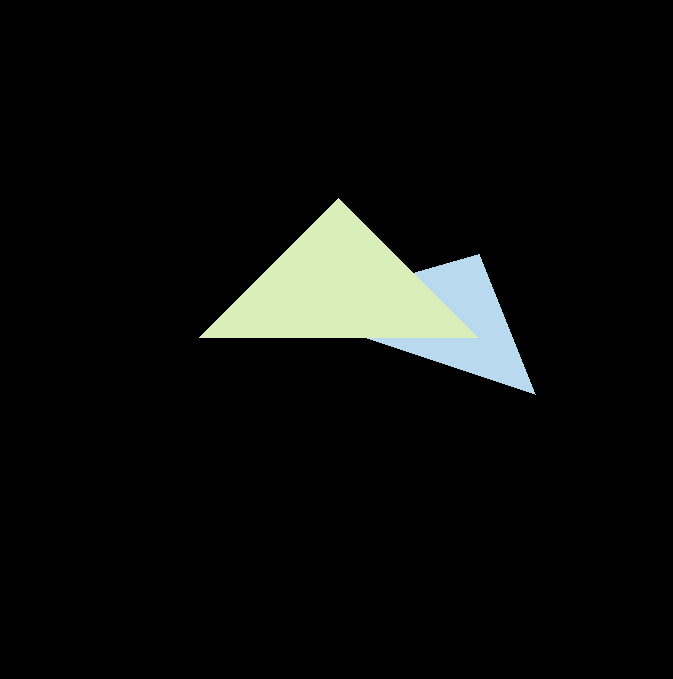

## 一、作业要求

1.实现三角形栅格化算法

2.确定测试点是否在三角形内

3.实现z-buffer算法

4.super-sampling 2*2 采样减少锯齿感（提高）

## 二、实现三角形栅格化算法

首先算出bounding_box的大小和坐标位置

```cpp
int min_x = INT_MAX,min_y = INT_MAX,max_x = 0,max_y = 0;
    min_x = std::min({v[0].x(),v[1].x(),v[2].x()});
    max_x = std::max({v[0].x(),v[1].x(),v[2].x()});
    min_y = std::min({v[0].y(),v[1].y(),v[2].y()});
    max_y = std::max({v[0].y(),v[1].y(),v[2].y()});
```

## 三、测试点是否在三角形内

```cpp
static bool insideTriangle(int x, int y, const Vector3f* _v)
{   
    // TODO : Implement this function to check if the point (x, y) is inside the triangle represented by _v[0], _v[1], _v[2]
    Vector2f a(_v[0].x()-x,_v[0].y()-y);
    Vector2f b(_v[1].x()-x,_v[1].y()-y);
    Vector2f c(_v[2].x()-x,_v[2].y()-y);

    float cross1 = a.x() * b.y() - a.y() * b.x();
    float cross2 = c.x() * a.y() - c.y() * a.x();
    float cross3 = b.x() * c.y() - b.y() * c.x();

    return (cross1>0 && cross2>0 && cross3>0 ) || (cross1<0 && cross2<0 && cross3<0);
}
```

二维叉乘公式：$a\times b = x_1y_2-x_2y_1$

如果和三个点叉乘均同号，则在三角形内

## 四、z-buffer算法

接着坐标遍历bounding_box中所有的点，计算出每个点的深度，如果当前点靠前则更新颜色

```cpp
auto[alpha, beta, gamma] = computeBarycentric2D(x+step[k][0], y+step[k][1], t.v);
float w_reciprocal = 1.0/(alpha / v[0].w() + beta / v[1].w() + gamma / v[2].w());
float z_interpolated = alpha * v[0].z() / v[0].w() + beta * v[1].z() / v[1].w() + gamma * v[2].z() / v[2].w();
z_interpolated *= w_reciprocal;
if(depth_buf[getindex(x,y)] == std::numeric_limits<float>::infinity() || z_interpolated > depth_buf[getindex(x,y)]){
    depth_buf[getindex(x,y)] = z_interpolated;
    frame_buf[getsuperindex(x,y)] = t.getColor();
    Eigen::Vector3f point(x*1.0,y*1.0,1.0);
    set_pixel(point,color);
}
```

## 五、Super_sampling

要求我们使用4x4采样，即每个点需要维护四个depth和frame

创建depth和frame

```cpp
std::vector<float> super_depth_buf;
std::vector<Eigen::Vector3f> super_frame_buf;
```

获取坐标函数

```cpp
int rst::rasterizer::getsuperindex(int x,int y,int k){
    return 4*get_index(x,y)+k;
}
```

遍历bounding_box中的每个点

```cpp
for(int k = 0;k<4;k++){
    if(!insideTriangle(x+step[k][0],y+step[k][1],t.v)) continue;
    //find interpolated depth value in this location
    auto[alpha, beta, gamma] = computeBarycentric2D(x+step[k][0], y+step[k][1], t.v);
    float w_reciprocal = 1.0/(alpha / v[0].w() + beta / v[1].w() + gamma / v[2].w());
    float z_interpolated = alpha * v[0].z() / v[0].w() + beta * v[1].z() / v[1].w() + gamma * v[2].z() / v[2].w();
     z_interpolated *= w_reciprocal;

    if(super_depth_buf[getsuperindex(x,y,k)] == std::numeric_limits<float>::infinity() || z_interpolated > super_depth_buf[getsuperindex(x,y,k)]){
         count++;
         super_depth_buf[getsuperindex(x,y,k)] = z_interpolated;
         super_frame_buf[getsuperindex(x,y,k)] = t.getColor();
    }
}
```

最后再遍历设定颜色，注意颜色要除以4

```cpp
for(int x = min_x;x<=max_x;x++){
        for(int y = min_y;y<=max_y;y++){
            Vector3f color = (super_frame_buf[getsuperindex(x,y,0)]+super_frame_buf[getsuperindex(x,y,1)]+super_frame_buf[getsuperindex(x,y,2)]+
                super_frame_buf[getsuperindex(x,y,3)])/4.0;
            Eigen::Vector3f point(x*1.0,y*1.0,1.0);
            set_pixel(point,color);
        }
    }
```

最终效果


